<div align="center">

# Holiday Lights 6

**Animated holiday lights around every monitor of your Windows&nbsp;11&nbsp;PC.**<br>
They glow, they flash, they dance to the music, they change with the seasons, and they stay behind your desktop icons where they belong.

[**Download for Windows 11**](https://github.com/starrlord/holidaylights/releases/latest) &nbsp;·&nbsp;
[See it in action](#why-youll-love-it) &nbsp;·&nbsp;
[Take the tour](#take-the-tour) &nbsp;·&nbsp;
[FAQ](#faq)


<br>

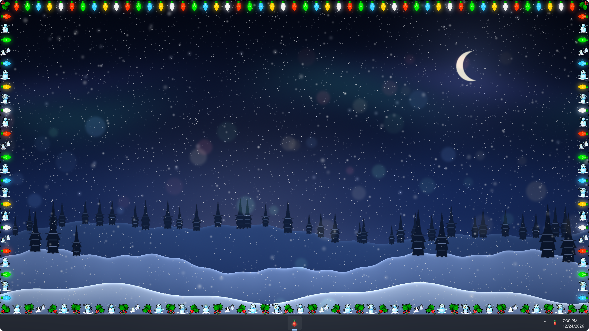

<sub>The <b>Christmas 1</b> theme on a 2560 x 1440 display at 150 % scaling, drawn with the <b>Bright Glow</b> look. Rendered by the app's own lights engine.</sub>

</div>

---

## A 2003 classic, reborn for Windows 11

Back in 2003, Tiger Technologies' **Holiday Lights** put strings of blinking bulbs around Windows desktops. It
had 49 built-in bulbs, a library of more than 1,500 bulbs drawn by its fans, a little Music Box of holiday MIDI songs
and a snowy screen saver. Then Windows moved on, and the old lights ended up blurry, squeezed into a corner of one
screen, or not working at all.

**Holiday Lights 6** is a from-scratch rebuild for today's Windows 11 PCs, with the same bulbs, the same five flash
patterns down to the millisecond, the same Music Box songs and the same screen saver, and a lot more:

* **Sharp on 4K and high-DPI screens.** The pixel art is upscaled with MMPX, so the bulbs keep their hand-drawn look
  at 125 %, 150 % or 200 % scaling.
* **Every monitor gets lights,** whatever its size, scaling or position. You can also wrap all of your monitors in
  one big wreath.
* **The bulbs really glow.** Lit bulbs throw soft light onto your wallpaper, and they fade on and off like real bulbs.
* **It sits behind your desktop icons,** like 2003, but it never takes a click, never steals focus and gets out of
  the way of full-screen games, videos and presentations.

<div align="center">
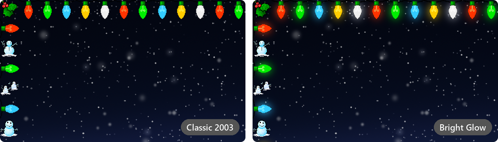
<br><sub>One click switches between the exact <b>Classic 2003</b> look and the modern ones (<b>Modern Glow</b>, the default, and <b>Bright Glow</b>).</sub>
</div>

## Why you'll love it

### It glows, it twinkles, it chases

Eleven flash patterns: the five classics from 2003 (**Don't Flash**, **Flash Together**, **Alternating**, **Bulb
Chase** and **Random Flashing**, timed exactly like the original) and six new ones (**Twinkle**, **Slow Glow**,
**Chase Around the Screen**, **Dance to the Music**, **Waves** and **Combination**). Pick a speed, and pick how much glow
you like.

<div align="center">
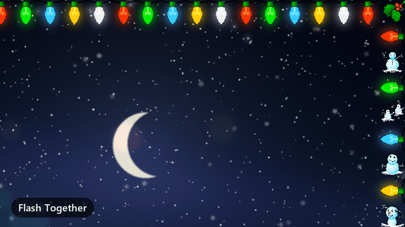
<br><sub>Flash Together, Bulb Chase and Twinkle, sampled frame by frame from the app's own flash engine and compositor.</sub>
</div>

### Every monitor, perfectly framed

Each display gets its own complete frame, laid out in that display's own pixels and scaling: 4K next to 1080p, a
monitor to the left of or above the main one, whatever you have. Or choose **All Displays Together** and Holiday
Lights wraps your whole desk in one wreath, with no bulbs across the seam between the screens.

<div align="center">
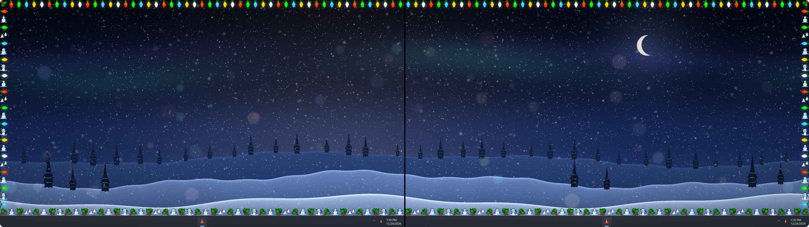
<br><sub><b>All Displays Together:</b> one wreath around two 2560 x 1440 displays.</sub>
</div>

### Themes that follow the calendar

Nineteen themes are included: the eleven classics from 2003 (Christmas 1, Christmas 2, Halloween, Thanksgiving,
Valentine's Day, Easter Eggs, St. Patrick's Day, July 4th, New Year, Chanukah and Blank Slate) and eight new ones such
as **Winter Wonderland**, **Christmas Twinkle**, **Bubble Lights** and **Holiday Party**. A theme sets the bulbs, the flash
pattern, the songs and the screen saver all at once. With **automatic themes** turned on (the default), Halloween
lights appear on October 1, Thanksgiving's in November and Christmas lights the day after Thanksgiving, all by
themselves. When the theme changes, the new lights power up with a wave that runs around the screen.

<div align="center">
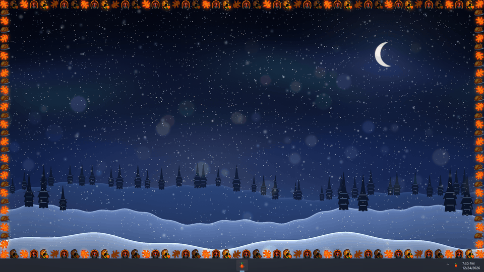
<br><sub>A theme change from Thanksgiving to Christmas 1, rendered with the presenter's own fade and power-up timings.</sub>
</div>

<div align="center">
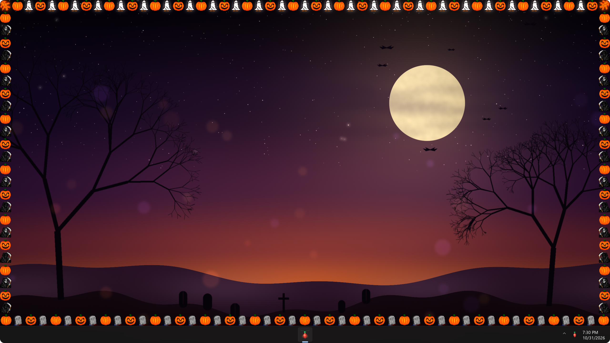
<br><sub>The <b>Halloween</b> theme, which the holiday calendar turns on from October 1 to October 31.</sub>
</div>

### 1,550 bulbs to choose from

Every bulb from the original is here: the 49 built-in bulbs and the 1,501 add-on bulbs drawn by 379 artists, from
classic Christmas bulbs and candy canes to snowmen, pumpkins, hearts, shamrocks and Easter eggs. Search them, filter them by
category, mark your favorites, and try a bulb on in the preview before you use it.

<div align="center">
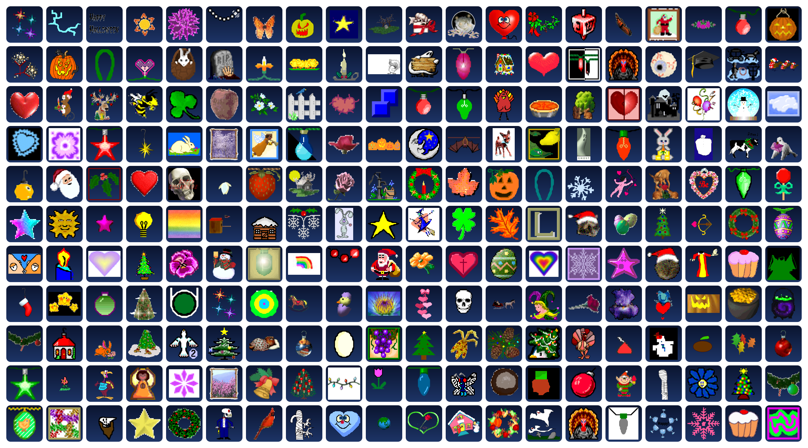
<br><sub>220 of the 1,550 bulbs, each shown with its own Bulb List preview.</sub>
</div>

### Lights that dance to the music

The **Music Box** plays 46 holiday songs in the background (carols, Halloween tunes, New Year and patriotic songs), or
your own MIDI, MP3, WMA, WAV, M4A and AIFF files. Turn on **Make the Lights Dance to the Music** and the bulbs
light up with the notes of the song. The music is off until you turn it on, and it pauses while you play a game, lock
your PC or start a Focus session.

### A screen saver, too

When your PC is idle, Holiday Lights can be your screen saver: your bulbs around falling snow, balloons, leaves,
Valentine's hearts or 20 other animations, with a picture and your own holiday message, on every monitor.

<div align="center">
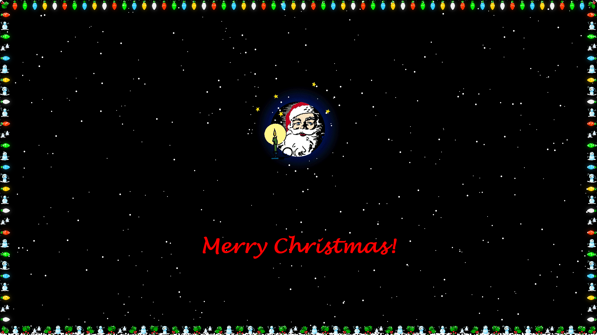
<br><sub>A frame of the real screen saver with the Christmas 1 theme: snow, the Santa Candle picture and a "Merry Christmas!" message.</sub>
</div>

### Always one click away

Holiday Lights lives in the notification area as a little red bulb. Click it for the menu: turn the lights on or off,
move them on top of your windows, pick a theme, skip a song, or open Settings.

<div align="center">
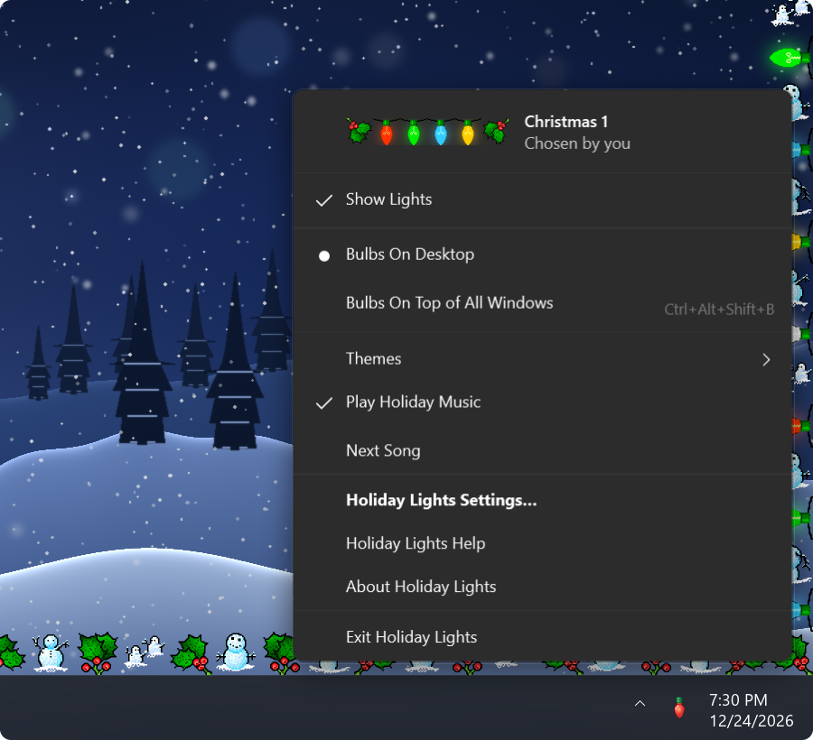
<br><sub>The tray menu, with the current theme's lights in its header.</sub>
</div>

## Take the tour

### Home

Your lights at a glance: a live preview of every display, the Show Lights switch, a status line that says exactly what
the lights are doing, and the themes for the season.

<div align="center">
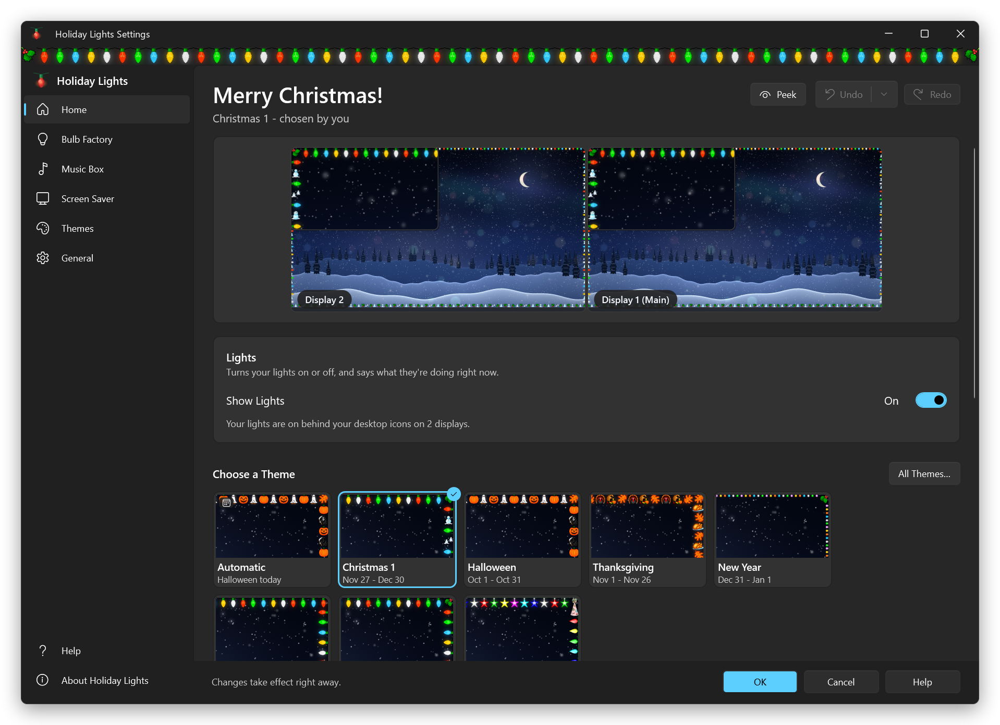
<br><sub><b>Settings &gt; Home</b></sub>
</div>

### Bulb Factory

The heart of Holiday Lights. Eight boxes frame a live, exact preview of your screen: four edges with up to six bulbs
each, which repeat along the edge, and four corners. Drag bulbs from the **Bulb List** into the boxes, or double-click
one to use it for the whole frame. Everything has Undo and Redo, and **Peek** shows you the real desktop.

<table>
<tr>
<td width="50%">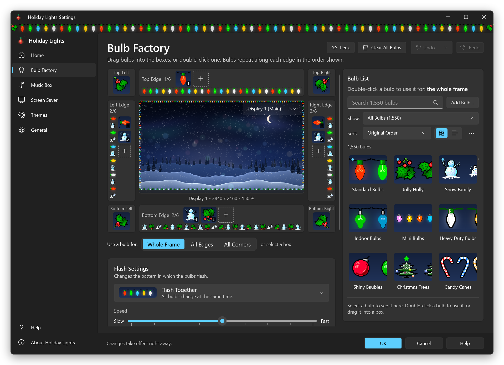</td>
<td width="50%">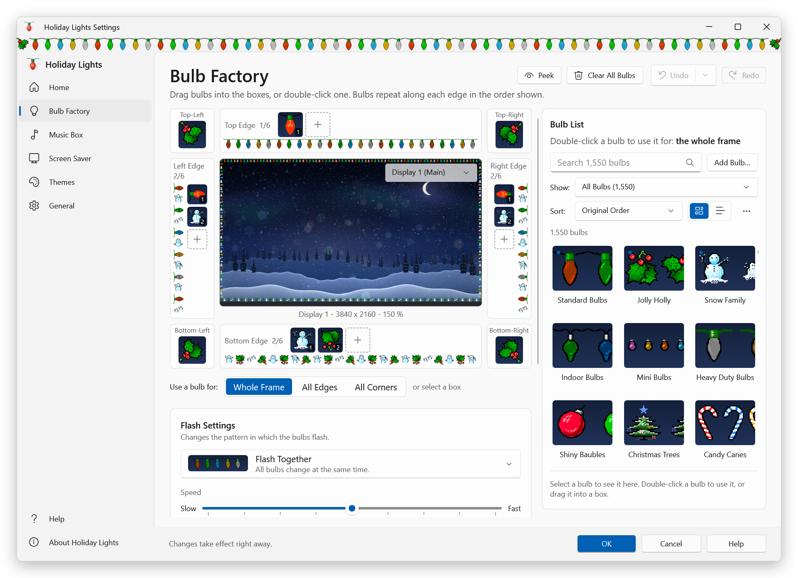</td>
</tr>
<tr>
<td align="center"><sub><b>Settings &gt; Bulb Factory</b> in the dark theme</sub></td>
<td align="center"><sub>...and in the light theme. Holiday Lights follows your Windows theme.</sub></td>
</tr>
</table>

### Bulb Editing

Make your own bulbs from GIF animations, give them flavors (alternative pictures for each edge) and share them as
`.bul` files that Holiday Lights 5.4 can open too.

<div align="center">
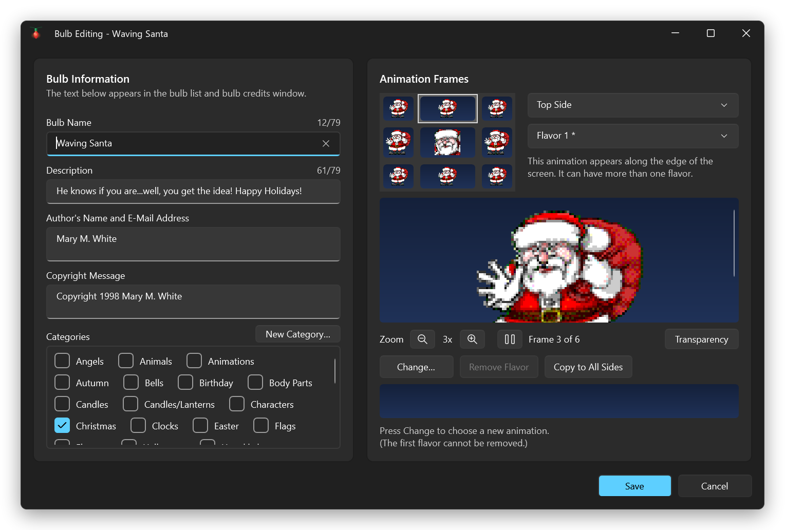
<br><sub><b>Bulb Editing</b> on the add-on bulb "Waving Santa" by Mary M. White.</sub>
</div>

### Music Box

<div align="center">
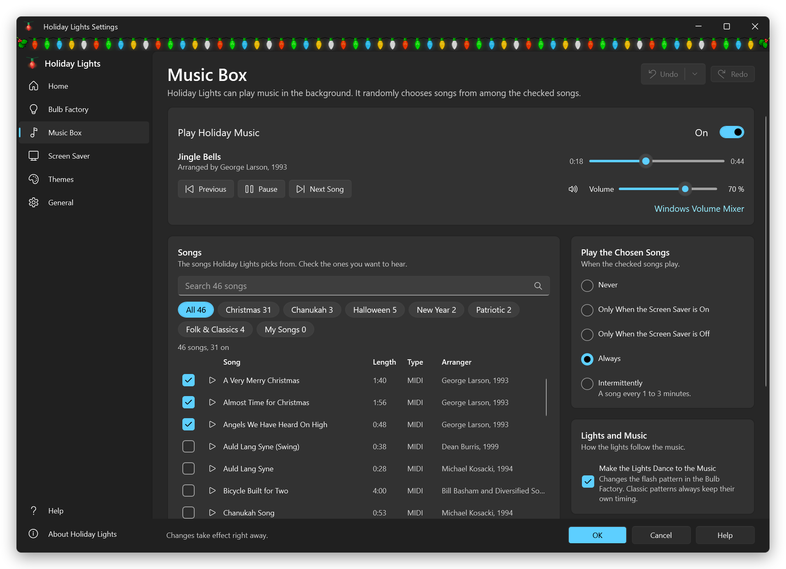
<br><sub><b>Settings &gt; Music Box:</b> 46 songs with their arrangers, category filters, your own songs, and the play modes from 2003.</sub>
</div>

### Screen Saver

<div align="center">
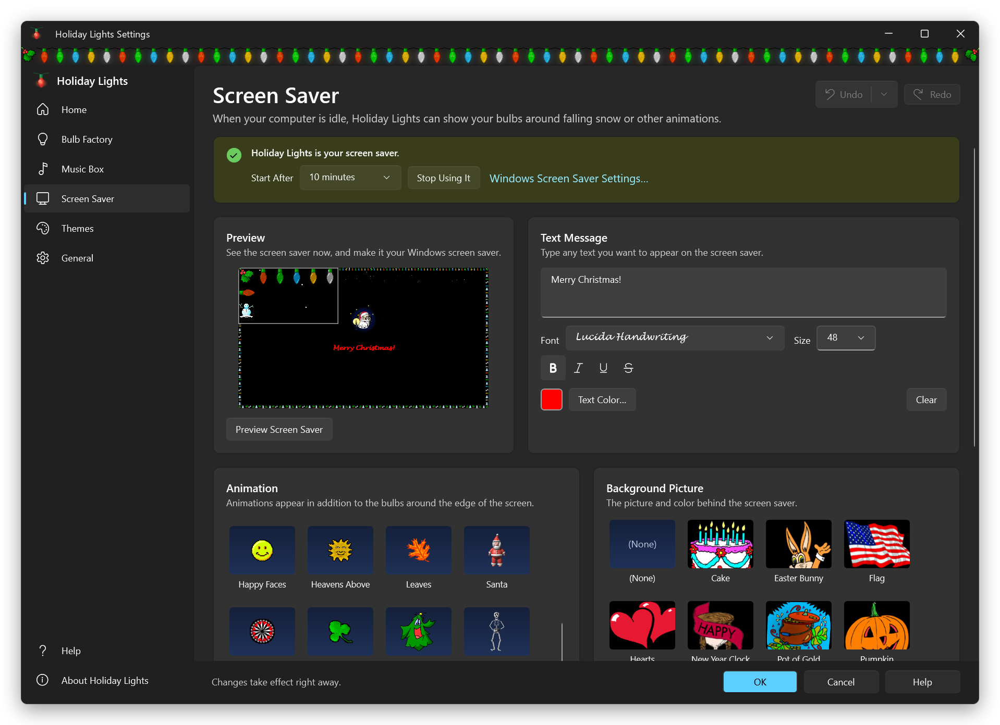
<br><sub><b>Settings &gt; Screen Saver</b> with its live preview. One button makes Holiday Lights your Windows screen saver, and uninstalling puts your old one back.</sub>
</div>

### Themes and the holiday calendar

<div align="center">
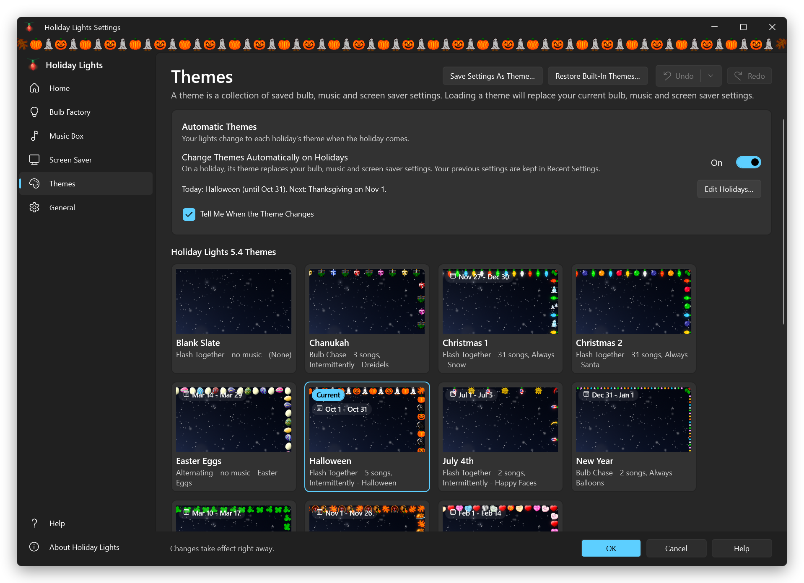
<br><sub><b>Settings &gt; Themes:</b> automatic themes, and every theme with its holiday dates.</sub>
</div>

<div align="center">
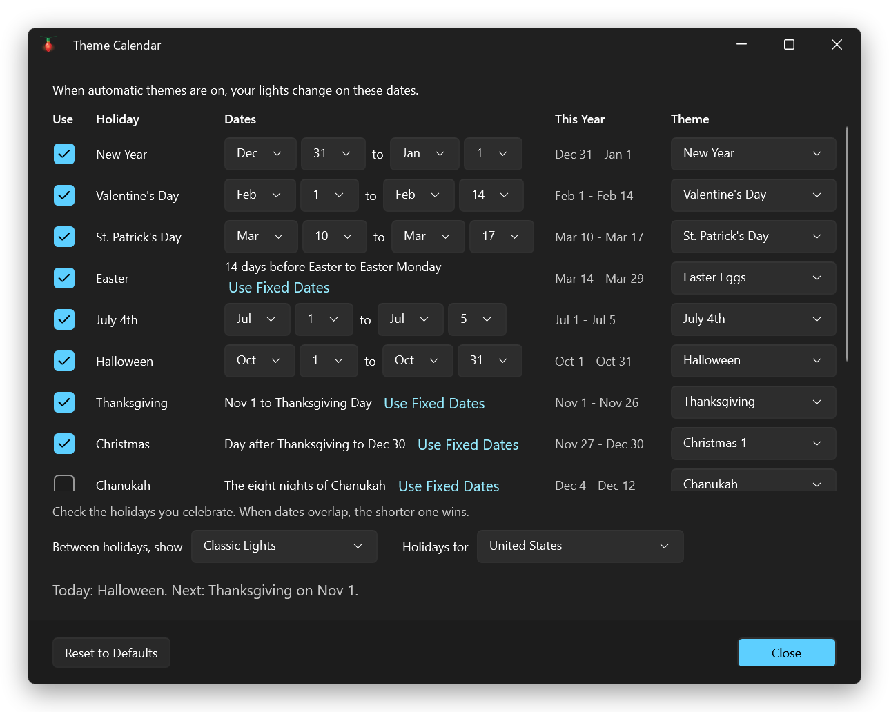
<br><sub><b>Theme Calendar:</b> choose which holidays you celebrate, their dates and their themes.</sub>
</div>

### General

<div align="center">
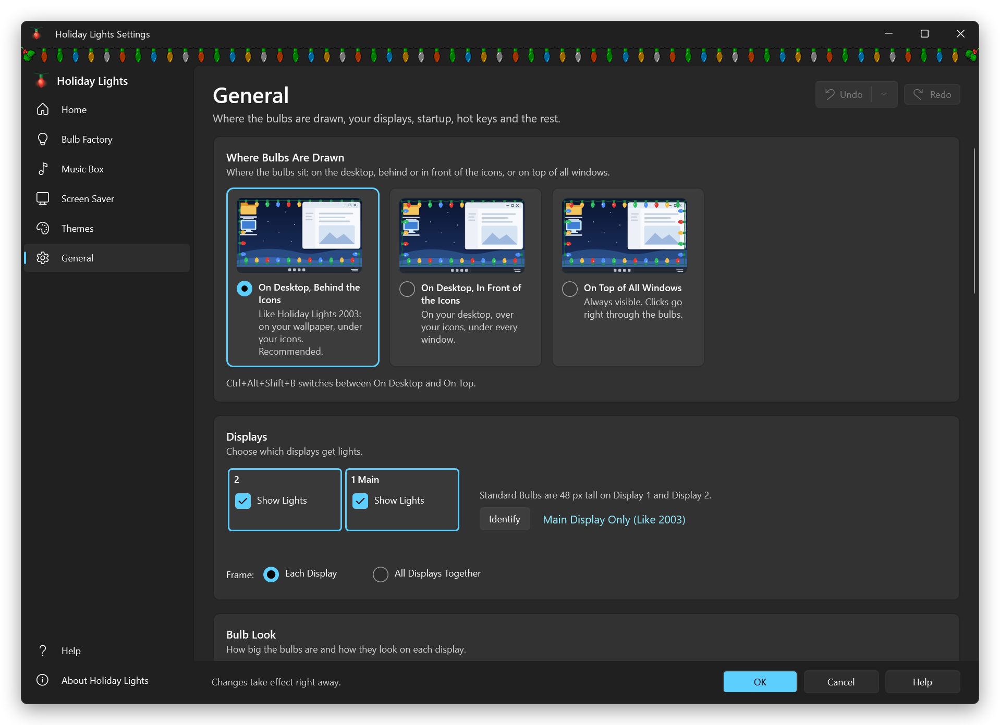
<br><sub><b>Settings &gt; General:</b> where the bulbs are drawn, which displays get lights, one frame per display or one around all of them, and much more below.</sub>
</div>

### Welcome and About

<table>
<tr>
<td width="47%" valign="top">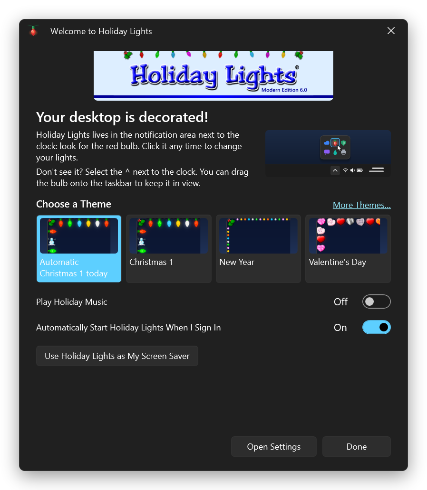</td>
<td width="53%" valign="top">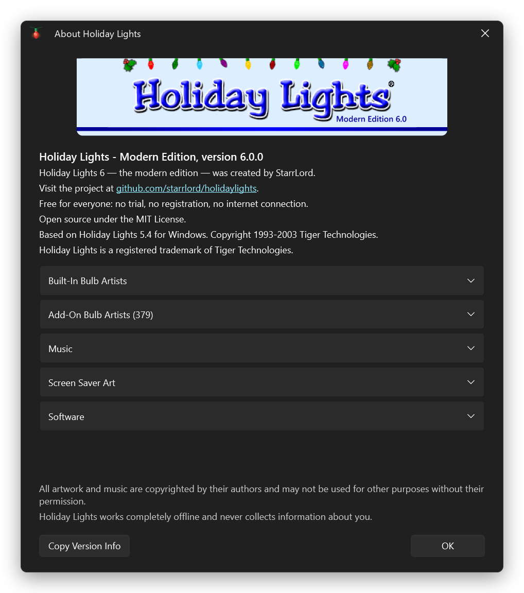</td>
</tr>
<tr>
<td align="center"><sub>The <b>Welcome</b> card on first start: your lights are already on, and the season's theme is one click away.</sub></td>
<td align="center"><sub><b>About Holiday Lights:</b> credits for every artist, arranger and component.</sub></td>
</tr>
</table>

> The screenshots are real: every window above was rendered from the app's own code (the Settings window, dialogs and
> menu at 150 % scaling, the lights, screen saver and animations with the app's own engines). Only the window frames,
> the wallpapers, the pattern labels in the animation and the desktop behind the tray menu were added for this page.

## Everything it does

**Lights**

* 1,550 bulbs: the 49 built-in bulbs and 1,501 add-on bulbs from Holiday Lights 5.4, plus any `.bul` files or GIF
  animations you add.
* Four edges with up to six bulbs each and four corner bulbs; one arrangement for all of your displays.
* 11 flash patterns, 9 speeds, smooth fading, and glow (Off, Soft or Bright). Looks: **Modern Glow** (default),
  **Bright Glow**, **Classic 2003** and Custom. Four bulb sizes.
* Drawn behind your desktop icons (default), in front of them, or on top of all windows (always below the taskbar).
  The lights never take clicks or focus. **Ctrl+Alt+Shift+B** switches between the desktop and on top.
* Every display, each at its own scaling, or **All Displays Together** as one wreath; turn lights off on any display.

**Themes**

* 19 themes, your own saved themes, and Recent Settings that keeps your last five setups.
* Automatic themes on holidays (New Year, Valentine's Day, St. Patrick's Day, Easter, July 4th, Halloween,
  Thanksgiving, Christmas, plus Chanukah if you check it), with **Classic Lights** between holidays and dates that
  follow your region.

**Music Box**

* 46 bundled holiday songs, and your own songs in MIDI, MP3, WMA, WAV, M4A, AIFF and AU formats.
* Play always, intermittently, only while the screen saver is on (or off), or never; volume, Previous, Pause and
  Next Song.
* **Dance to the Music:** the lights follow the notes of the song.

**Screen saver**

* Your bulbs around 24 animations (Snow, Snow Flakes, Balloons, Leaves, Santa, Halloween, Valentine's Hearts and more,
  or any add-on bulb), four motion styles, 11 pictures or your own, and your message in any font and color.
* Shows on every monitor, with a live preview in Settings.

**Bulb Factory and Bulb Editing**

* Search, categories, favorites, try-on, Undo and Redo, and drag and drop or keyboard-only editing.
* Turn GIF animations into bulbs, edit flavors and credits, and export `.bul` files that work in 5.4 too.

**Respectful by design**

* **Private and offline:** no internet connection, no telemetry, no update checks, no account. Logs stay on your PC.
* **Light on your PC:** the lights are drawn with DirectComposition on the GPU, and the CPU only wakes up at the flash
  steps. The design budget is under 0.5 % of one CPU core with the default theme on two 4K displays, and nothing at
  all while the lights are hidden.
* **Out of the way:** the lights step aside on a display while a full-screen app or game runs there, during
  presentations, and while your PC is locked. When Windows Energy Saver is on they use less power.
* **Accessible:** every feature works with the keyboard and with Narrator or NVDA, High Contrast is supported, and
  **Limit Flashing to 3 Flashes per Second** keeps the lights festive for photosensitive viewers.
* **Your 2003 setup comes along:** if Holiday Lights 5.4 is on your PC, your settings, themes, categories and your own
  bulbs, songs and pictures are imported on first start.

## Download and install

1. Go to the **[Releases page](https://github.com/starrlord/holidaylights/releases)** and download
   **`HolidayLights-<version>-win-x64.zip`** from the latest release.
2. Extract the zip (right-click it, then **Extract All**).
3. In the extracted folder, double-click **`Setup.exe`**.

Holiday Lights installs for you only, in `%LOCALAPPDATA%\Programs\HolidayLights`, so **no administrator rights** are
needed. The usual download includes everything Holiday Lights needs, so it works on any 64-bit Windows 11 PC, even
offline. If your PC already has the [.NET 10 Desktop Runtime (x64)](https://dotnet.microsoft.com/download/dotnet/10.0),
you can take the smaller `HolidayLights-<version>-win-x64-framework-dependent.zip` instead. Each release lists SHA-256
checksums for both zips.

> [!NOTE]
> Holiday Lights is not code-signed, so the first time you run `Setup.exe`, Windows SmartScreen may say "Windows
> protected your PC". Choose **More info**, then **Run anyway**.

**System requirements:** 64-bit Windows 11. Holiday Lights works with any number of displays, at any scaling.

## Quick start

1. **The lights are on.** After setup, Holiday Lights starts and powers up its lights around every display, and the
   Welcome card shows where to find it. With automatic themes on, you get the season's theme right away.
2. **Click the red bulb** in the notification area (next to the clock; if you don't see it, select **^**) to open the
   menu. Choose **Themes** to change the theme, or **Show Lights** to turn the lights off and on.
3. **Double-click the red bulb** (or choose **Holiday Lights Settings...**) to open Settings. On the **Bulb Factory**
   page, double-click any bulb to put it around the whole frame.
4. **Want music?** Turn on **Play Holiday Music** on the Welcome card, in the menu or on the **Music Box** page.
5. **Want the screen saver?** On the **Screen Saver** page, choose **Use Holiday Lights as My Screen Saver**.

Holiday Lights starts with Windows (you can turn that off on the Welcome card or the General page), and Help is built
in: choose **Holiday Lights Help** in the menu, or press **F1** in Settings.

## FAQ

<details>
<summary><b>Will it slow down my PC?</b></summary>

No. The lights are drawn by the GPU through DirectComposition, and the CPU only works when the bulbs change: the design
budget is under 0.5 % of one CPU core with the default theme on two 4K displays. When the lights are hidden (a
full-screen game, a locked PC, a display that is off), nothing is drawn at all. On a laptop with Energy Saver on,
Holiday Lights automatically uses less power; you can also choose to stop the flashing or turn the lights off.
</details>

<details>
<summary><b>Does it work with several monitors?</b></summary>

Yes. Every display gets its own complete frame at its own scaling, wherever it is (left of, right of or above the main
display, 4K or not). On the General page you can turn the lights off for any display, choose **Main Display Only**
like 2003, or choose **All Displays Together** to put one wreath around all of your monitors.
</details>

<details>
<summary><b>Will the lights cover my windows?</b></summary>

Not unless you want them to. By default the bulbs are drawn on the desktop behind your icons, so every window covers
them. You can put them in front of the icons, or on top of all windows (they always stay below the taskbar and never
take a click). **Ctrl+Alt+Shift+B** switches between the desktop and on top. In every mode, the lights hide on a
display while a full-screen app or game runs there, and during presentations.
</details>

<details>
<summary><b>Will it play music when I don't expect it?</b></summary>

No. Music is off until you turn it on, and Holiday Lights never changes your Windows settings unless you ask.
</details>

<details>
<summary><b>I used Holiday Lights 5.4. Do I lose my setup?</b></summary>

No. On first start, Holiday Lights 6 imports your 5.4 settings, themes, categories and the bulbs, songs and pictures
you added. If you never changed 5.4's settings, you get the new seasonal look, and **Use My 2003 Lights** on the
Welcome card brings back the exact 2003 setup. The **Classic 2003** look restores the original crisp, glow-free bulbs.
</details>

<details>
<summary><b>Does it collect any data?</b></summary>

No. Holiday Lights never connects to the internet: no telemetry, no update checks, no account. The only web link in
the app is the project page in the About window, and it opens only when you click it.
</details>

<details>
<summary><b>How do I uninstall it?</b></summary>

Open **Settings > Apps > Installed apps** in Windows, find **Holiday Lights** and choose **Uninstall**. The uninstaller
removes the program, its screen saver, its startup entry and its `.bul` file association, and puts back the screen
saver you had before. It asks before it removes your own bulbs, songs and pictures (kept in
`Documents\Holiday Lights`), and it removes your settings and themes only if you check that box.
</details>

<details>
<summary><b>Is it really free?</b></summary>

Yes. No trial, no registration, no ads. The source code is MIT-licensed, and the classic content is included with
permission (see [License](#license)).
</details>

## Build from source

You need Windows 11 and the [.NET 10 SDK](https://dotnet.microsoft.com/download/dotnet/10.0) (10.0.400 or later, see
`global.json`).

```powershell
git clone https://github.com/starrlord/holidaylights.git
cd holidaylights
dotnet build HolidayLights.sln -c Release
dotnet test HolidayLights.sln -c Release --filter "Category!=Live"
```

To try a build without touching your real settings, startup entry, screen saver or file associations, run it with a
private data folder:

```powershell
.\src\HolidayLights.App\bin\Release\net10.0-windows10.0.26100.0\HolidayLights.exe --data-root "$env:TEMP\hl-try" --no-system-changes
```

`pwsh tools/publish/publish.ps1` builds the distributable folder and zip (`HolidayLights.exe`, `Setup.exe` and the
bundled content). Releases are built by GitHub Actions when a `v*` tag is pushed; see
[docs/RELEASING.md](docs/RELEASING.md).

| Folder | What's inside |
|---|---|
| `src/HolidayLights.Core` | Bulb files and the bulb library, layout, flash patterns, sprites and glow, themes and the holiday calendar, settings |
| `src/HolidayLights.Rendering` | The DirectComposition presenter: the lights behind the icons, power-up and theme transitions |
| `src/HolidayLights.Platform` | Displays, the desktop host, hot keys, pausing rules, installation helpers |
| `src/HolidayLights.Audio` | The Music Box: MIDI and audio playback, Dance to the Music |
| `src/HolidayLights.App` | The WPF app: tray menu, Settings, Bulb Editing, screen saver, Help, installer |
| `tests/HolidayLights.Tests` | xUnit tests, including golden data that pins the 2003 layouts and flash patterns |
| `content` | The bundled bulbs, songs and pictures ([content/README.md](content/README.md)) |
| `docs` | [Product spec](docs/PRODUCT-SPEC.md), [architecture](docs/ARCHITECTURE.md), [contracts](docs/CONTRACTS.md), [user guide](docs/USER-GUIDE.md) |

## Credits

* **Holiday Lights 6**, the modern edition, was created by **[StarrLord](https://github.com/starrlord/holidaylights)**.
* **Holiday Lights** was created by **Tiger Technologies** (Holiday Lights 5.4 for Windows, copyright 1993-2003 Tiger
  Technologies). Holiday Lights is a registered trademark of Tiger Technologies.
* **Bulb artists:** the built-in bulbs were drawn by Joe Lachoff, Robert L. Mathews, Mark Pettus (Mighty Toad
  Software), Mary Lee Seward and Gail Allinson, and the 1,501 add-on bulbs by 379 artists from the Holiday Lights
  community. Every artist is credited in the About window, in each bulb's **Bulb Credits** and in
  [content/README.md](content/README.md). Thank you, every one of you!
* **Music:** arranged by George Larson, Michael Kosacki, Dean Burris, Bill Basham and Diversified Software Research,
  Thomas Thurston and the Night Gallery Halloween Web site.
* **Screen saver pictures:** licensed from ArtToday.
* **Software:** .NET and WPF, [Vortice.Windows](https://github.com/amerkoleci/Vortice.Windows),
  [NAudio](https://github.com/naudio/NAudio), [H.NotifyIcon](https://github.com/HavenDV/H.NotifyIcon),
  [VirtualizingWrapPanel](https://github.com/sbaeumlisberger/VirtualizingWrapPanel) and the MMPX pixel-art
  magnification algorithm by Morgan McGuire and Mara Gagiu, all under the MIT License.

## License

The source code of Holiday Lights 6 is released under the **[MIT License](LICENSE)**, copyright (c) 2026 StarrLord.

The bundled content is **not** covered by the MIT License: the bulb art, the music arrangements and the screen saver
pictures in [`content/`](content/), and the classic Holiday Lights 5.4 artwork in `assets/builtin/`, `assets/heritage/`
and `assets/icons/generator/cells/` (the built-in bulbs, the About banner, the screen saver sprites and the bulb cells
the app icon is drawn from). It is included in Holiday Lights with permission and remains the copyright of its artists,
its arrangers and Tiger Technologies, who are credited above, in the app and in [content/README.md](content/README.md).
It may not be used for other purposes without their permission.
