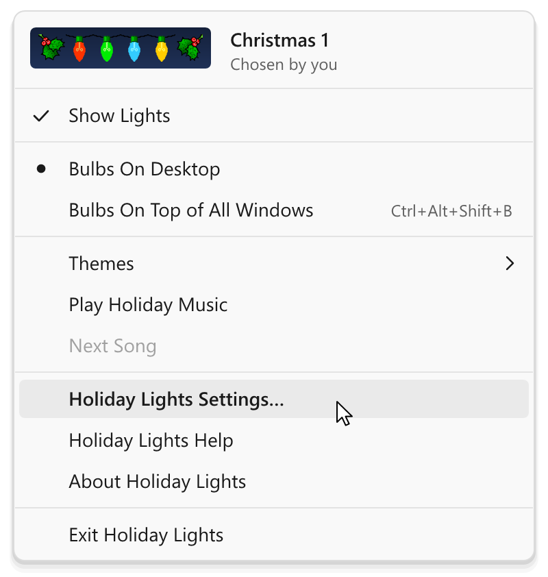
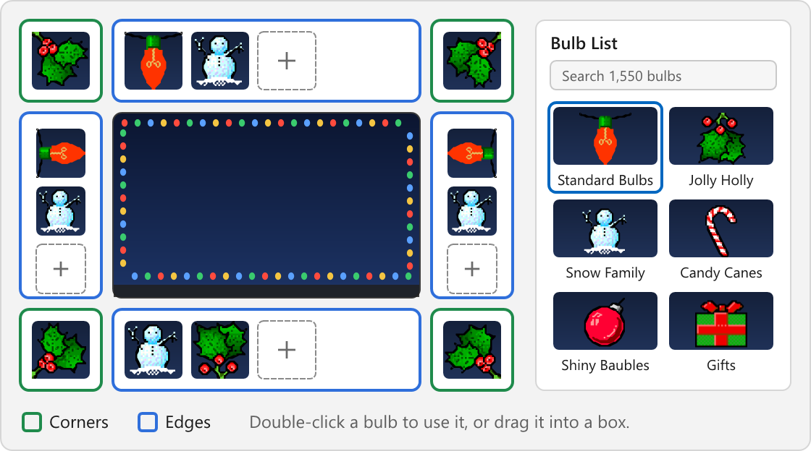

# Holiday Lights Modern Edition 6.0 - User Guide

Holiday Lights decorates the edges of your screen with strings of festive bulbs, plays holiday music if you like, and shows a cheerful screen saver when your computer is idle. This guide covers everything in Holiday Lights - Modern Edition 6.0 for Windows 11.

It is the same text as the Help inside the program: click the red bulb in the notification area and choose **Holiday Lights Help**, or press F1 in Holiday Lights Settings.

## Contents

- [Getting Started](#getting-started)
  - [Welcome to Holiday Lights](#welcome-to-holiday-lights)
  - [About Holiday Lights](#about-holiday-lights)
  - [Starting Holiday Lights](#starting-holiday-lights)
  - [The Taskbar Icon](#the-taskbar-icon)
  - [Turning the Lights On and Off](#turning-the-lights-on-and-off)
  - [Exiting Holiday Lights](#exiting-holiday-lights)
  - [Permanently Removing Holiday Lights](#permanently-removing-holiday-lights)
  - [Coming from Holiday Lights 5.4](#coming-from-holiday-lights-54)
  - [What's New in 6.0](#whats-new-in-60)
- [Arranging the Bulbs](#arranging-the-bulbs)
  - [About Holiday Lights Bulbs](#about-holiday-lights-bulbs)
  - [Changing Bulbs in the Settings Window](#changing-bulbs-in-the-settings-window)
  - [Finding Bulbs](#finding-bulbs)
  - [Viewing Bulbs by Category](#viewing-bulbs-by-category)
  - [Displaying Bulbs On the Desktop or Above All Windows](#displaying-bulbs-on-the-desktop-or-above-all-windows)
  - [Using a Hot Key to Choose Where Bulbs Are Drawn](#using-a-hot-key-to-choose-where-bulbs-are-drawn)
  - [Using the Taskbar Icon Menu to Choose Where Bulbs Are Drawn](#using-the-taskbar-icon-menu-to-choose-where-bulbs-are-drawn)
  - [Bulbs on Several Displays](#bulbs-on-several-displays)
  - [Bulb Size, Glow and the Classic 2003 Look](#bulb-size-glow-and-the-classic-2003-look)
  - [Changing the Flash Pattern](#changing-the-flash-pattern)
  - [Changing the Flash Speed](#changing-the-flash-speed)
  - [Adding Your Own Bulbs](#adding-your-own-bulbs)
  - [Making Your Own Bulbs](#making-your-own-bulbs)
  - [Sharing Your Bulbs](#sharing-your-bulbs)
- [Playing Background Music](#playing-background-music)
  - [About Music](#about-music)
  - [Turning Music On and Off](#turning-music-on-and-off)
  - [Turning Songs On and Off](#turning-songs-on-and-off)
  - [Choosing When Music is Played](#choosing-when-music-is-played)
  - [Adding New Songs](#adding-new-songs)
  - [Volume](#volume)
  - [Making the Lights Dance](#making-the-lights-dance)
  - [Solving Music Problems](#solving-music-problems)
- [Using the Screen Saver](#using-the-screen-saver)
  - [About the Screen Saver](#about-the-screen-saver)
  - [Turning the Screen Saver On or Off](#turning-the-screen-saver-on-or-off)
  - [Animations and Styles](#animations-and-styles)
  - [Background Pictures](#background-pictures)
  - [Text Message](#text-message)
  - [Several Displays](#several-displays)
- [Holiday Lights Themes](#holiday-lights-themes)
  - [About Holiday Lights Themes](#about-holiday-lights-themes)
  - [Changing Themes Automatically on Holidays](#changing-themes-automatically-on-holidays)
  - [Recent Settings](#recent-settings)
- [When the Lights Rest](#when-the-lights-rest)
- [Keyboard Shortcuts](#keyboard-shortcuts)
- [Troubleshooting](#troubleshooting)
  - [I Can't See My Lights](#i-cant-see-my-lights)
  - [The Taskbar Icon Is Missing](#the-taskbar-icon-is-missing)
  - [There Is No Music](#there-is-no-music)
  - [The Screen Saver Doesn't Start](#the-screen-saver-doesnt-start)
  - [My Hot Key Doesn't Work](#my-hot-key-doesnt-work)
  - [The Bulbs Are in Front of My Icons](#the-bulbs-are-in-front-of-my-icons)
- [Credits](#credits)
  - [Art Copyright Information](#art-copyright-information)
  - [Music Copyright Information](#music-copyright-information)
  - [Software Credits](#software-credits)

## Getting Started

### Welcome to Holiday Lights

Holiday Lights decorates the edges of your screen with strings of festive bulbs. Your lights come on by themselves whenever Holiday Lights starts, and with Automatic themes they follow the holidays: Halloween lights in October, Christmas lights in December, and classic lights in between.

#### Where to Find Holiday Lights

Holiday Lights lives in the notification area of the taskbar, next to the clock. Look for the red bulb.

- Click the red bulb once (not twice) to see the Holiday Lights menu.
- Double-click it to open Holiday Lights Settings.
- Don't see it? Select the **^** button next to the clock to show hidden icons. You can drag the red bulb onto the taskbar to keep it in view.

#### Three Things to Try

1. **Change the theme.** Click the red bulb, point to **Themes** and choose a theme, such as **Christmas 1**.
2. **Choose your own bulbs.** Double-click the red bulb, select **Bulb Factory**, and double-click a bulb you like. It goes all around your screen at once.
3. **Turn on some music.** Click the red bulb and choose **Play Holiday Music**.

Everything you change shows on your desktop right away, and **Undo** in the Settings window takes it back.

To learn more, read [The Taskbar Icon](#the-taskbar-icon) and [About Holiday Lights Bulbs](#about-holiday-lights-bulbs). If you used Holiday Lights before, see [Coming from Holiday Lights 5.4](#coming-from-holiday-lights-54).

*In Holiday Lights: the Home page of Holiday Lights Settings.*

### About Holiday Lights

Holiday Lights places strings of holiday bulbs around the edges of your screen, with festive music playing in the background if you'd like it.

The bulbs appear on your desktop wallpaper or on top of all other windows, so you'll feel the holiday spirit while you work on other things. You can choose from 1,550 different bulbs and 46 songs, and add your own.

When your computer is idle, Holiday Lights can also show a screen saver with your bulbs around falling snow or other animations.

#### What's Inside

- **Bulbs:** the 49 bulbs of Holiday Lights 5.4 and 1,501 add-on bulbs drawn by hundreds of artists. See [About Holiday Lights Bulbs](#about-holiday-lights-bulbs).
- **Themes:** ready-made sets of bulbs, music and screen saver settings for every holiday, which can change by themselves on holidays. See [About Holiday Lights Themes](#about-holiday-lights-themes).
- **Music Box:** 46 holiday songs that can play in the background. See [About Music](#about-music).
- **Screen saver:** your bulbs around snow, balloons, leaves and more. See [About the Screen Saver](#about-the-screen-saver).

Holiday Lights is free for everyone: no trial, no registration, no internet connection. It works completely offline and never collects information about you.

Holiday Lights 6, the modern edition, was created by StarrLord. The project home is https://github.com/starrlord/holidaylights. See [Software Credits](#software-credits).

#### Getting Help

Press F1 in Holiday Lights Settings, or select **Help**, to read about the page you are on. Use the Contents on the left, or search, to find any topic. Select **About Holiday Lights** in the menu of the red bulb to see the version and the credits.

*In Holiday Lights: the Home page of Holiday Lights Settings.*

### Starting Holiday Lights

To start Holiday Lights, open the Start menu and select **Holiday Lights**. Your lights come on within a moment and the red bulb appears in the notification area. No window opens: Holiday Lights works quietly in the background.

If Holiday Lights is already running, starting it again opens Holiday Lights Settings.

#### Starting Holiday Lights Automatically

Holiday Lights can start every time you sign in to Windows, so your lights come back after every restart.

1. Double-click the red bulb in the notification area to open Holiday Lights Settings.
2. Select **General**.
3. Under **Startup Settings**, check or uncheck **Automatically Start Holiday Lights**.

The change takes effect at once. Uncheck the box to use Holiday Lights only as a screen saver; you can still start it at any time from the Start menu.

If the box is checked but Holiday Lights doesn't start, Windows may have turned it off. The General page then says "Startup is turned off for Holiday Lights in Windows Settings." Select **Open Startup Apps** and turn Holiday Lights on there.

#### More on the General Page

The General page also holds the settings you change least often:

- **Where Bulbs Are Drawn** and **Displays**: see [Displaying Bulbs On the Desktop or Above All Windows](#displaying-bulbs-on-the-desktop-or-above-all-windows) and [Bulbs on Several Displays](#bulbs-on-several-displays).
- **Bulb Look**: see [Bulb Size, Glow and the Classic 2003 Look](#bulb-size-glow-and-the-classic-2003-look).
- **Hot Keys**: see [Using a Hot Key to Choose Where Bulbs Are Drawn](#using-a-hot-key-to-choose-where-bulbs-are-drawn).
- **When the Lights Rest** and **Accessibility**: see [When the Lights Rest](#when-the-lights-rest).
- **Files and Folders**: open the folders that hold your own bulbs, songs and pictures, and choose whether double-clicking a .bul file adds it to Holiday Lights. See [Adding Your Own Bulbs](#adding-your-own-bulbs).
- **Holiday Lights 5.4**: see [Coming from Holiday Lights 5.4](#coming-from-holiday-lights-54).
- **Reset and Uninstall**: see [Permanently Removing Holiday Lights](#permanently-removing-holiday-lights).

*In Holiday Lights: the General page of Holiday Lights Settings.*

### The Taskbar Icon

When Holiday Lights is running, it places a small red bulb in the notification area of the taskbar, next to the clock.

#### Showing the Holiday Lights Menu

You can click the red bulb once (not twice) with either mouse button to see a menu of Holiday Lights options:

| Item | What it does |
|---|---|
| **Show Lights** | Turns the lights on or off on every display. Music is not affected. |
| **Bulbs On Desktop** | Draws the bulbs on your desktop, below all your windows. |
| **Bulbs On Top of All Windows** | Draws the bulbs above all windows. The hot key is shown next to the choice it would switch to. |
| **Themes** | Loads a theme, or turns Automatic themes on. |
| **Play Holiday Music** | Turns all music on or off. |
| **Next Song** | Starts another song now. |
| **Holiday Lights Settings…** | Opens the Settings window. |
| **Holiday Lights Help** | Opens this Help. |
| **About Holiday Lights** | Shows the version and the credits. |
| **Exit Holiday Lights** | Turns off the lights and closes Holiday Lights. |

The top of the menu shows a little string of your current bulbs, the name of your theme, and whether you or Automatic themes chose it.

To adjust the bulbs, music and screen saver, choose **Holiday Lights Settings…** from this menu. You can also double-click the red bulb to open the Settings window at once.

#### What the Icon Tells You

- A bright red bulb means your lights are on, even while they rest for a full-screen app.
- A dark red bulb means you turned the lights off.
- Point to the bulb to see your theme, where the bulbs are drawn and the song that's playing.

#### Using the Keyboard

Press Windows logo key+B to move to the notification area, then use the arrow keys to reach the red bulb. Press Enter or Space to open Holiday Lights Settings, or Shift+F10 to open the menu.

#### Can't Find the Icon?

Windows may hide it behind the **^** button next to the clock. Select **^** to show hidden icons, then drag the red bulb onto the taskbar to keep it in view. See [The Taskbar Icon Is Missing](#the-taskbar-icon-is-missing).

*In Holiday Lights: the Home page of Holiday Lights Settings.*

### Turning the Lights On and Off

You can turn the lights off for a while without exiting Holiday Lights. Music and the screen saver keep working.

- Click the red bulb in the notification area and choose **Show Lights**. The check mark shows whether the lights are on.
- Or open Holiday Lights Settings, select **Home**, and use the **Show Lights** switch.
- Or use a hot key: on the General page, under **Hot Keys**, check **Turn the Lights On or Off**. It uses Ctrl+Alt+Shift+L unless you choose another combination.

While the lights are off, the red bulb in the notification area is dark. Your choice is remembered, even after a restart. When you turn the lights back on, they come on with a short wave of light.

Holiday Lights also rests the lights by itself, for example while a game or a full-screen video plays. See [When the Lights Rest](#when-the-lights-rest).

#### The Home Page

Home shows everything most people change, with a live picture of your displays and their lights:

- **Show Lights**, and a line that tells you where your lights are and which theme comes next.
- **Choose a Theme**: click a card to load a theme. Pointing at a card previews it in the picture at the top. See [About Holiday Lights Themes](#about-holiday-lights-themes).
- **Flash Settings** and **Bulb Drawing**: see [Changing the Flash Pattern](#changing-the-flash-pattern) and [Displaying Bulbs On the Desktop or Above All Windows](#displaying-bulbs-on-the-desktop-or-above-all-windows).
- **Bulb Size**: see [Bulb Size, Glow and the Classic 2003 Look](#bulb-size-glow-and-the-classic-2003-look).
- **Music**: see [Turning Music On and Off](#turning-music-on-and-off).
- **Change Bulbs…** and **Screen Saver…** open those pages. You can also click a display in the picture to change its bulbs.

Select **Peek** to hide the Settings window for three seconds and look at your real desktop, or press and hold it for as long as you like.

*In Holiday Lights: the Home page of Holiday Lights Settings.*

### Exiting Holiday Lights

To exit Holiday Lights, click once on the red bulb in the notification area and choose **Exit Holiday Lights** from the menu. The lights fade out, any music fades away, and the red bulb disappears.

If the Settings window is open, your changes are kept. If you are editing a bulb and haven't saved it, Holiday Lights asks first.

Closing the Settings window doesn't exit Holiday Lights: your lights stay on, and you can come back at any time by clicking the red bulb.

To turn the lights off for a while without exiting, see [Turning the Lights On and Off](#turning-the-lights-on-and-off). To start Holiday Lights again, see [Starting Holiday Lights](#starting-holiday-lights).

### Permanently Removing Holiday Lights

You can permanently remove Holiday Lights from your computer at any time.

1. Double-click the red bulb in the notification area to open Holiday Lights Settings, and select **General**.
2. Under **Reset and Uninstall**, select **Uninstall Holiday Lights…**.
3. Select **Uninstall** to confirm.

You can also remove it like any other app: open Windows **Settings**, select **Apps**, then **Installed apps**, find **Holiday Lights** and select **Uninstall**.

#### What Is Removed

The uninstaller removes the program, its screen saver, its startup entry and the .bul file association. If Holiday Lights was your screen saver, the screen saver you had before comes back.

Your own bulbs, songs and pictures in `Documents\Holiday Lights` are kept unless you choose to remove them when the uninstaller asks. Your settings and themes are removed only if you check **Also remove my settings and themes**.

Holiday Lights 5.4, if it is still on your PC, is never changed.

#### Starting Over Instead

If you only want your settings back the way they were when Holiday Lights was installed, select **Reset All Settings…** under **Reset and Uninstall**. Your themes, bulbs, songs and pictures are kept, and Recent Settings keeps your current settings in case you change your mind. To bring back the themes that came with Holiday Lights, select **Restore Built-In Themes…**.

*In Holiday Lights: the General page of Holiday Lights Settings.*

### Coming from Holiday Lights 5.4

Welcome back! The first time Holiday Lights starts, it brings over everything from Holiday Lights 5.4 on this PC, without changing anything in 5.4 itself:

- your bulb arrangement, flash pattern and speed, and where the bulbs are drawn;
- your songs, which of them are checked, and when music plays;
- every screen saver setting, from the text message and its font to the animation, picture and colors;
- all your themes, under their own names;
- your hot key letter, your custom colors and your bulb categories;
- the bulbs, songs and pictures you added to 5.4.

To see exactly what was brought over, open Holiday Lights Settings, select **General**, and under **Holiday Lights 5.4** select **Import Details…**.

#### If You Never Changed the 5.4 Settings

If Holiday Lights 5.4 was still at its standard settings, your lights now follow the holidays instead: Automatic themes are on and music is off. Your 5.4 settings are kept. To use them, select **Use My 2003 Lights** on the welcome card, or restore "Holiday Lights 5.4 Settings" from **Recent Settings** on the Themes page.

#### If You Customized 5.4

Your own lights come back exactly as you left them. Automatic themes stay off, and music plays the way you set it up. To try the new seasonal look instead, select **Start Fresh Instead** on the welcome card: your themes stay, and your old settings are kept in Recent Settings.

#### What Feels the Same

- Click the red bulb once for the menu; double-click it for Settings.
- The Settings pages keep their names: Bulb Factory, Music Box, Screen Saver and General, with Home first and Themes where Sharing used to be.
- You still drag bulbs into the boxes around your screen, and drag them back to the list to remove them.
- The five classic flash patterns keep their exact 2003 timing.
- For the exact 2003 look (square pixels, no glow, no fading), choose **Classic 2003** under **Look** on the General page.

#### What's Different

- **The hot key** is now Ctrl+Alt+Shift+B, because web browsers use Ctrl+Shift+B for the bookmarks bar. Your 5.4 letter is kept. To use Ctrl+Shift+B anyway, change it under **Hot Keys** on the General page.
- **Closing the Settings window keeps your changes.** **Cancel** still undoes everything since you opened the window, and Esc no longer closes it.
- **Each edge holds six kinds of bulbs**, and double-clicking a bulb now uses it. To edit a bulb, select it and choose **Edit Bulb…**.
- **All 1,501 add-on bulbs are included**, so there is nothing to download.
- **Everything is unlocked and free.** The Sharing tab, the order form and "Tell a Friend" are gone, because Holiday Lights no longer goes online. To share a bulb you made, use **Export Bulb File…**.

#### Old Leftovers

Holiday Lights 5.4 doesn't work properly on this version of Windows. If it is still running, still starts with Windows, or is still set as your screen saver, the welcome card and the **Holiday Lights 5.4** group on the General page offer a one-click fix for each. **Import Again…** brings your 5.4 settings over once more.

*In Holiday Lights: the General page of Holiday Lights Settings.*

### What's New in 6.0

Welcome to Holiday Lights Modern Edition 6.0, rebuilt for Windows 11.

- Your lights fit every display again, sharp at any Windows scaling.
- They can sit behind your desktop icons (like before), in front of them, or on top of everything.
- A gentle glow and soft fading, or the Classic 2003 look with one click.
- Four new patterns: Twinkle, Slow Glow, Chase Around the Screen and Dance to the Music.
- All 1,501 add-on bulbs are included, with search, categories and favorites.
- Six kinds of bulbs on every edge, and you can drag them into a new order.
- Themes can change automatically on holidays.
- Real music volume and a choice of MIDI synthesizer.
- The screen saver runs on every display, and previewing it never changes your Windows settings.
- The hot key is now Ctrl+Alt+Shift+B, so web browsers keep Ctrl+Shift+B.
- Everything is unlocked and free, and Holiday Lights never goes online.

#### A Few More Things

- Undo and Redo on every Settings page, and a Cancel button that really puts everything back.
- Eight new themes, from Autumn Harvest to Winter Wonderland.
- Try a bulb on in the preview before you use it, and keep your favorites one click away.
- A wave of light runs around your screen when your lights come on.

If you used Holiday Lights 5.4 before, see [Coming from Holiday Lights 5.4](#coming-from-holiday-lights-54).

*In Holiday Lights: the Home page of Holiday Lights Settings.*

## Arranging the Bulbs

### About Holiday Lights Bulbs

Holiday Lights places rows of "bulbs" around the edges of your screen. The bulbs are small pictures that flash on and off (or show other animations) on your desktop wallpaper while you work. You can also [set the bulbs to display on top of other windows](#displaying-bulbs-on-the-desktop-or-above-all-windows) so they'll never be covered up.

You can choose from 1,550 different bulbs (and even [add your own](#adding-your-own-bulbs)), and you can mix and match up to six different kinds of bulbs on each edge of the screen, plus one bulb in each corner.

#### Kinds of Bulbs

- **Built-In Bulbs:** the 49 bulbs that came inside Holiday Lights 5.4, such as Standard Bulbs, Jolly Holly and Candy Canes.
- **Add-On Bulbs:** 1,501 more bulbs drawn by hundreds of artists, all included.
- **My Bulbs:** bulbs you add or make yourself.

Some bulbs are light bulbs that switch on and off; with **Smooth Fading** they fade like real bulbs, and lit bulbs can [glow](#bulb-size-glow-and-the-classic-2003-look). Others are little animations, like carolers or spinning dreidels, and some are still pictures, like the sprigs of holly that suit the corners.

Every bulb carries the credits of its artist: select a bulb and choose **Bulb Credits**.

You choose how the bulbs appear on your screen on the Bulb Factory page of Holiday Lights Settings. See [Changing Bulbs in the Settings Window](#changing-bulbs-in-the-settings-window).

*In Holiday Lights: the Bulb Factory page of Holiday Lights Settings.*

### Changing Bulbs in the Settings Window

To change the bulbs, double-click the red bulb in the notification area to open Holiday Lights Settings, then select **Bulb Factory**.

The middle of the page is a live picture of your screen with your real lights. Around it are eight boxes, one for each edge and each corner of your screen. Beside them, the Bulb List shows all your bulbs.

#### The Fastest Way: Double-Click a Bulb

Double-click any bulb in the Bulb List to use it. Above the list, a sentence tells you where it will go, for example "Double-click a bulb to use it for: the whole frame".

You choose where a double-clicked bulb goes with the buttons under the boxes, or by selecting a box:

| Choose | What double-clicking a bulb does |
|---|---|
| **Whole Frame** | Puts the bulb on every edge and in every corner. |
| **All Edges** | Puts it on all four edges; the corners stay. |
| **All Corners** | Puts it in all four corners; the edges stay. |
| A bulb in an edge box | Replaces that bulb, in the same place. |
| The **+** at the end of an edge | Adds the bulb at the end of that edge. |
| A corner box | Puts the bulb in that corner. |

**Whole Frame** is selected each time you open the page. Pressing Enter on a bulb, or selecting the **Use for** button under the list, does the same as a double-click.

Just selecting a bulb never changes your lights. The picture of your screen shows how the bulb would look ("Trying On"), while your desktop stays as it is until you double-click.

#### Edges and Corners

Each edge holds up to six kinds of bulbs, which repeat along the edge in the order shown. For example, if you put Santa Claus, Gifts and Jolly Holly on the top edge, you'll have a repeating pattern of these three bulbs along the top of your screen. The little sample in each edge box shows exactly how they line up.

Each corner holds a bulb of its own. For example, you can put a sprig of holly in each corner, even if you don't use holly on the edges.

#### Dragging Bulbs

You can also drag bulbs, just as in Holiday Lights 5.4:

- Drag a bulb from the list into an edge box to add it at that place. If the edge already has six kinds of bulbs, drop it onto a bulb to replace that one.
- Drag a bulb into a corner box, or onto a corner of the picture, to put it in that corner.
- Drag a bulb from one box to another to copy it there. Hold Shift to move it instead.
- Drag a bulb within its edge to change the order.
- To remove a bulb from an edge or corner, drag it back to the Bulb List or anywhere outside the boxes. You can also point to it and select its remove button, or select it and press Delete.

You can even drag bulb files and GIF pictures from File Explorer straight into a box. See [Adding Your Own Bulbs](#adding-your-own-bulbs).

#### Other Ways

- **Add To…**, under the selected bulb, shows a small picture of your screen. Choose an edge to add the bulb to, or a corner to put it in. **Add to Every Edge**, **Use in All Corners** and **Use Everywhere** do just what they say.
- Right-click a bulb for more choices, such as **Add to Top Edge**, **Bulb Credits** or **Use as Screen Saver Animation**.
- Right-click a box for **Clear** and **Copy This Edge to All Edges**.
- **Clear All Bulbs**, at the top of the page, takes every bulb off the screen.

Changed your mind? Select **Undo**, or press Ctrl+Z. Every change is one step, and **Cancel** puts everything back the way it was when you opened the window.

#### Using the Keyboard

Press Tab to reach the boxes and use the arrow keys to move between them. Press Enter on a box to jump to the search box, type the name of a bulb, and press Enter on the bulb to put it there. Delete removes the selected bulb from its box. See [Keyboard Shortcuts](#keyboard-shortcuts).

#### More on the Bulb Factory

- [Finding Bulbs](#finding-bulbs)
- [Changing the Flash Pattern](#changing-the-flash-pattern) and [Changing the Flash Speed](#changing-the-flash-speed)
- [Displaying Bulbs On the Desktop or Above All Windows](#displaying-bulbs-on-the-desktop-or-above-all-windows)
- [Making Your Own Bulbs](#making-your-own-bulbs)

*In Holiday Lights: the Bulb Factory page of Holiday Lights Settings.*

### Finding Bulbs

With 1,550 bulbs to choose from, the Bulb List on the Bulb Factory page helps you find the one you want.

#### Searching

Type in the search box above the Bulb List, press Ctrl+F, or just start typing while the list is selected. The list shows the bulbs whose name, categories, description, artist or file name contain every word you type, best matches first. For example, type "snow" to find snowmen, snowflakes and snowy trees. Press Esc to clear the search.

#### Show

**Show** narrows the list to a group of bulbs:

| Show | Bulbs |
|---|---|
| **All Bulbs** | every bulb |
| **Favorites** | the bulbs you starred |
| **In Use** | the bulbs on your screen right now |
| **For** a holiday | the bulbs for the holiday going on now, for example "For Halloween" |
| **Built-In Bulbs** | the 49 bulbs of Holiday Lights 5.4 |
| **Add-On Bulbs** | the add-on bulbs, including yours |
| **My Bulbs** | the bulbs you added or made |
| a category | for example Christmas, Winter or Flags |
| **Removed Bulbs** | the bulbs you removed (shown only when there are some) |

Each choice shows how many bulbs it has. **Show** goes back to **All Bulbs** each time you open the Settings window, so a filter never hides bulbs without you noticing. You can also right-click an empty part of the list and choose **Show**. See [Viewing Bulbs by Category](#viewing-bulbs-by-category).

#### Favorites

Select the star on any bulb, or press Ctrl+D, to add it to your favorites. Select the star again to take it out.

#### Sort and View

**Sort** lists the bulbs in their **Original Order** (the 2003 bulbs first, then the add-on bulbs from A to Z), by **Name**, or **Newest First**.

**Tiles** shows each bulb as it looks along the top of your screen. **Details** shows the classic list with each bulb's description, as in Holiday Lights 5.4.

#### Bulb Tags

- **Big**: the bulb is larger than 64 pixels and makes a thick border.
- **New**: you added the bulb in the last day.
- A dot: the bulb is on your screen now.
- A warning sign: the bulb is damaged.

#### Bulbs You Removed

Choose **Show**, then **Removed Bulbs**, to see the bulbs you removed from the list. Select **Restore** on a bulb to bring it back.

*In Holiday Lights: the Bulb Factory page of Holiday Lights Settings.*

### Viewing Bulbs by Category

Bulbs belong to categories, such as Christmas, Halloween, Winter or Flags. If you have many bulbs, you may find it useful to view the categories one at a time.

#### Viewing a Category

On the Bulb Factory page, open **Show** above the Bulb List and choose a category. Each category shows how many bulbs it has. You can also right-click the Bulb List and choose a category from the **Show** menu that appears.

#### Assigning Bulbs to Categories

You can put any bulb in one or more categories. For example, you could assign a pumpkin bulb to categories named "Autumn" and "Halloween", making it easy to find later by viewing either one.

1. Select the bulb in the Bulb List.
2. Select **Edit Categories…** (or **Edit Bulb…** for a bulb you made yourself).
3. Use the check boxes to choose one or more categories for the bulb. To make a new category, select **New…** (or **New Category…**), type its name, and select **OK**.
4. Select **Save**.

A category name can have up to 39 characters. Your choices are kept in your settings; the bulb file itself is never changed.

*In Holiday Lights: the Bulb Factory page of Holiday Lights Settings.*

### Displaying Bulbs On the Desktop or Above All Windows

You can choose whether bulbs are drawn on your desktop or on top of all windows. This only affects where bulbs are drawn while you use your computer; it doesn't affect the screen saver.

The pictures show, from left to right:

| Choice | Where the bulbs are |
|---|---|
| **On Desktop**, behind the icons (the standard choice) | On your wallpaper, under your desktop icons, like Holiday Lights 2003. Your icons stay in front of the bulbs and keep working. |
| **On Desktop**, in front of the icons | On your desktop, over your icons, but under every window. |
| **On Top** | Above all windows, so they're always visible. Clicks go right through the bulbs, they hide while a full-screen app or game is open, and the taskbar always stays in front of them. |

Displaying the bulbs on top of all windows makes sure they are always visible, but it may distract you when the bulbs cover part of your screen. Displaying them on your desktop keeps them out of your way, but windows sometimes cover them. Many people keep the bulbs on the desktop and press the hot key to bring them on top for a moment.

#### Changing Where Bulbs Are Drawn

- On the Bulb Factory or Home page, under **Bulb Drawing**, select **On Desktop** or **On Top**. On the Bulb Factory page, **Behind the Desktop Icons** chooses whether the bulbs go behind or in front of your icons.
- On the General page, under **Where Bulbs Are Drawn**, select one of the three pictures.
- Or press the hot key, or use the menu of the red bulb: see [Using a Hot Key to Choose Where Bulbs Are Drawn](#using-a-hot-key-to-choose-where-bulbs-are-drawn) and [Using the Taskbar Icon Menu to Choose Where Bulbs Are Drawn](#using-the-taskbar-icon-menu-to-choose-where-bulbs-are-drawn).

#### When Windows Doesn't Allow It

Now and then, Windows doesn't let Holiday Lights draw behind the icons for a while, for example just after Windows Explorer restarts. The bulbs then move in front of the icons (or on top of your windows) so you can still see them, and they move back by themselves as soon as they can. The Home page shows a note while this happens, with **Try Again**. See [The Bulbs Are in Front of My Icons](#the-bulbs-are-in-front-of-my-icons).

*In Holiday Lights: the Bulb Factory page of Holiday Lights Settings.*

### Using a Hot Key to Choose Where Bulbs Are Drawn

Instead of opening Holiday Lights Settings to choose whether bulbs are drawn on your desktop or on top of all other windows, you can press a hot key to switch between the two at once.

The hot key works in any program. If the bulbs are on top of your windows and in the way, just press it and they move to the desktop; press it again to bring them back on top. A small note at the top of the screen tells you where the bulbs went.

The standard hot key is **Ctrl+Alt+Shift+B**. (Holiday Lights 5.4 used Ctrl+Shift+B, but web browsers use that combination to show the bookmarks bar.) If you press the hot key while the lights are off, the lights come on, on top of your windows.

#### Changing or Turning Off the Hot Key

1. Open Holiday Lights Settings and select **General**.
2. Under **Hot Keys**, find **Switch Between On Desktop and On Top**.
3. Uncheck it to turn the hot key off. Or select **Change…**, press the keys you want, and select **Save**.

A hot key needs Ctrl, Alt or the Windows logo key, unless it's a function key (F1 to F24) or Pause. While you choose, Holiday Lights tells you if another program already uses the combination, if it would type a character on one of your keyboard layouts, or if other programs rely on it, as browsers do on Ctrl+Shift+B. **Use Default** goes back to Ctrl+Alt+Shift+B.

#### A Hot Key for the Lights

Check **Turn the Lights On or Off** under **Hot Keys** to turn all the lights on or off with Ctrl+Alt+Shift+L, or with a combination you choose.

You can also change where bulbs are drawn using the menu of the red bulb. See [Using the Taskbar Icon Menu to Choose Where Bulbs Are Drawn](#using-the-taskbar-icon-menu-to-choose-where-bulbs-are-drawn).

*In Holiday Lights: the General page of Holiday Lights Settings.*

### Using the Taskbar Icon Menu to Choose Where Bulbs Are Drawn

There's one other way to choose whether bulbs are drawn on your desktop or on top of all other windows.

You can simply click once on the red bulb in the notification area and choose either **Bulbs On Desktop** or **Bulbs On Top of All Windows** from the menu that appears. The dot shows the current choice, and the hot key is shown next to the other one.

This gives you a way to change the setting easily, even if you forget the hot key. **Bulbs On Desktop** keeps your choice of drawing the bulbs behind or in front of your desktop icons.

*In Holiday Lights: the Bulb Factory page of Holiday Lights Settings.*

### Bulbs on Several Displays

If you use more than one display, Holiday Lights decorates every one of them, each with a complete frame of bulbs sized for that display. The bulbs on all displays flash together.

On each display, the bottom bulbs sit just above the taskbar. If your taskbar is at the top or on a side, the bulbs make room for it.

#### Choosing Displays

1. Open Holiday Lights Settings and select **General**.
2. Under **Displays**, check or uncheck **Show Lights** on each display in the picture. Select **Identify** to show each display's number on the display itself.

At least one display always keeps its lights, and a display you connect later gets lights by itself. To light only the main display, as Holiday Lights 2003 did, select **Main Display Only (Like 2003)**.

#### One Frame Around All Displays

Under **Frame**, choose:

- **Each Display**: a separate frame of bulbs around every display. This is the standard choice.
- **All Displays Together**: a single wreath of bulbs around your whole desktop, as if your displays were one big screen. Where two displays meet, there are no bulbs between them.

All displays show the same arrangement of bulbs. The Bulb Factory preview shows one display at a time; if you have several, choose which one in the corner of the preview.

*In Holiday Lights: the General page of Holiday Lights Settings.*

### Bulb Size, Glow and the Classic 2003 Look

Holiday Lights draws the original bulb art sharply at any Windows display scaling. You decide how big the bulbs are and how they shine.

#### Bulb Size

On the Home page, or under **Bulb Look** on the General page, choose **Small**, **Standard**, **Large** or **Extra Large**. **Standard** gives the bulbs the same size compared with everything else on your screen as in 2003: on a display scaled to 150 %, Standard Bulbs are 48 pixels tall. **Small** is three quarters of that, **Large** one and a half times, and **Extra Large** twice.

#### Look

**Look**, under **Bulb Look** on the General page, chooses how the bulbs are drawn:

| Look | What you see |
|---|---|
| **Modern Glow** (the standard choice) | Smooth pixels, a soft glow around lit bulbs, and gentle fading. |
| **Bright Glow** | The same, with a stronger glow. |
| **Classic 2003** | Square pixels, no glow, no fading, and the 2003 screen saver motion: exactly like Holiday Lights 5.4. |
| **Custom** | Chosen by itself when you change the settings below. |

The picture shows Classic 2003, Modern Glow and Bright Glow, from left to right.

You can also change each part on its own:

- **Pixels**: **Smooth** keeps the hand-drawn look at any size; **Crisp** shows square pixels, like 2003.
- **Glow**: **Off**, **Soft** or **Bright**. Lit bulbs give off a soft light that brightens the wallpaper around them. The glow shows best on darker wallpapers; on a white wallpaper you won't see it.
- **Smooth Fading**: light bulbs fade on and off like real bulbs instead of switching instantly. It's also under **Flash Settings** on the Bulb Factory and Home pages.
- **Smooth Screen Saver Motion**: snow, balloons and text move smoothly in the screen saver.

*In Holiday Lights: the General page of Holiday Lights Settings.*

### Changing the Flash Pattern

Once you've arranged the bulbs, you can change the pattern in which they flash. The pattern decides whether the bulbs all flash together, flash in an alternating pattern, or do something else.

To change the flash pattern, open Holiday Lights Settings, select **Bulb Factory** (or **Home**), and choose a pattern under **Flash Settings**. The lights change at once, and each pattern in the list shows a little preview.

#### Classic Patterns

These five patterns come from Holiday Lights 5.4 and keep their exact 2003 timing.

| Pattern | What it does |
|---|---|
| **Don't Flash** | The bulbs stay lit. |
| **Flash Together** | All bulbs change at the same time. |
| **Alternating** | Every other bulb flashes. |
| **Bulb Chase** | The lights run along each edge. |
| **Random Flashing** | Bulbs flash at random, repeating every 8 steps like the original. |

The "Bulb Chase" and "Alternating" patterns look the same if the bulb simply flashes on and off (as, for example, with the Standard Bulbs), but these two patterns give different results with more complex bulbs such as Stockings and Menorahs.

#### New in 6.0

| Pattern | What it does |
|---|---|
| **Twinkle** | Each light twinkles on its own, like real twinkle lights. |
| **Slow Glow** | All lights slowly brighten and dim together. |
| **Chase Around the Screen** | One light in three runs clockwise around the whole screen. |
| **Dance to the Music** | The lights play along with the music. Between songs: Slow Glow. |

The new patterns shine with light bulbs, such as Standard Bulbs or Mini Bulbs. Animated bulbs, such as Carolers, keep playing their animations in time with the pattern. **Dance to the Music** follows the songs of the Music Box, so it needs music turned on; see [Making the Lights Dance](#making-the-lights-dance).

#### Smooth Fading

With **Smooth Fading** checked, light bulbs fade on and off like real bulbs instead of switching instantly. The classic patterns keep their exact rhythm either way.

To change how fast the bulbs flash, see [Changing the Flash Speed](#changing-the-flash-speed).

*In Holiday Lights: the Bulb Factory page of Holiday Lights Settings.*

### Changing the Flash Speed

You can easily adjust how rapidly the bulbs flash on and off. Open Holiday Lights Settings, select **Bulb Factory** (or **Home**), and move the slider under **Flash Settings** between **Slow** and **Fast**. The text under the slider tells you how long each step lasts, from "One step every 0.54 s" to "One step every 0.06 s". The standard speed is one step every 0.30 seconds.

The speed doesn't apply when the pattern is **Don't Flash**. With **Dance to the Music**, the slider sets the speed between songs.

Slower speeds use less of your computer's power.

#### If Flashing Bothers You

Very fast flashing can be uncomfortable for some people. On the General page, under **Accessibility**, check **Limit Flashing to 3 Flashes per Second**. The lights keep flashing, but never faster than three times a second: the two fastest speeds are turned off, and light bulbs always fade gently.

If animation effects were turned off in Windows when you first started Holiday Lights, this choice is already on.

*In Holiday Lights: the Bulb Factory page of Holiday Lights Settings.*

### Adding Your Own Bulbs

Holiday Lights allows you to add your own custom bulbs. All 1,501 add-on bulbs that were ever offered for Holiday Lights are already included, so you can also add bulbs that friends send you, and turn animated GIF pictures into new bulbs.

#### Adding a Bulb File

Bulb files end in .bul. To add one, do any of these:

- Double-click the .bul file in File Explorer. Holiday Lights copies it to your bulbs folder and shows it, selected, on the Bulb Factory page.
- On the Bulb Factory page, select **Add Bulb…** above the Bulb List and choose one or more files.
- Drag the files from File Explorer anywhere onto the Settings window. Drop a file onto one of the eight boxes to add the bulb and put it there at once.

If you already have the same bulb, Holiday Lights selects it instead of adding it twice. A new bulb shows a **New** tag for a day. Double-click it to use it, or drag it into a box.

To add every bulb file in a folder, select the **…** button above the Bulb List and choose **Import Bulb Files from a Folder…**.

#### Turning an Animated GIF into a Bulb

Select **Add Bulb…** and choose an animated GIF picture, or drop it on the window. Holiday Lights makes a new bulb from it and opens **Bulb Editing**, where you can name it and give it a different picture for each edge. See [Making Your Own Bulbs](#making-your-own-bulbs). If you add several GIF pictures at once, Holiday Lights makes a bulb from each one without opening the editor.

Animated GIF pictures can be made with many paint programs.

#### Where Your Bulbs Are Kept

Bulbs you add or make are kept in your Documents folder, in `Holiday Lights\Bulbs`. To open it, select the **…** button above the Bulb List and choose **Open My Bulbs Folder**. Bulb files you copy into this folder yourself appear in the Bulb List at once. **Show**, then **My Bulbs**, lists all of them.

If a bulb file can't be read, Holiday Lights tells you which one and leaves it alone; it never deletes a file by itself.

#### Removing a Bulb

Right-click a bulb and choose **Remove Bulb**. Nothing is asked, because **Undo** brings it back:

- Bulbs you added go to the Recycle Bin when you close the Settings window. Until then, **Undo** or **Cancel** brings them back.
- Add-on bulbs that came with Holiday Lights are only hidden. Choose **Show**, then **Removed Bulbs**, and select **Restore** to bring one back.
- The 49 built-in bulbs can't be removed.

If a removed bulb was on your screen, it disappears from your lights too.

*In Holiday Lights: the Bulb Factory page of Holiday Lights Settings.*

### Making Your Own Bulbs

You can make a bulb from any animated GIF picture and give it a different picture for each edge and corner of the screen. Bulbs you made yourself open in **Bulb Editing**; for bulbs made by others, you can edit their categories.

#### Starting a New Bulb

On the Bulb Factory page, select **Add Bulb…** and choose a GIF picture. Holiday Lights makes a new bulb from it, uses the picture for every edge and corner, and opens Bulb Editing. To edit one of your bulbs later, select it in the Bulb List and choose **Edit Bulb…**.

#### Bulb Information

The text in this group appears in the bulb list and the bulb credits window.

- **Bulb Name** and **Description** are shown in the Bulb List. Each can have up to 79 characters.
- **Author's Name and E-Mail Address** and **Copyright Message** are shown when someone views the bulb's credits.
- **Categories**: check the categories the bulb belongs to, so you can show a single category in the Bulb List later. **New Category…** adds a category.

#### Animation Frames

You can use different GIF animations for different sides and corners. Choose the place you want to preview or change in the small map of the screen, or in the list beside it: **Bulb List Preview**, **Top Side**, **Left Side**, **Right Side**, **Bottom Side**, or one of the four corners.

Select **Change…** to choose a new GIF animation for that place, or drop a GIF picture on the preview. You can also choose one or more PNG pictures of the same size: they become the frames of the animation, in file-name order.

**Flavors.** A side can have up to eight different GIF animations. Each animation is called a flavor; along the edge, the flavors take turns, which is how the Standard Bulbs come in five colors. Choose a flavor in the second list ("Flavor 1" to "Flavor 8"; a `*` marks the flavors that already have an animation), then select **Change…** to give it a picture. **Remove Flavor** removes the selected flavor; the first flavor can't be removed. Corners and the bulb list preview have one animation each. **Copy to All Sides** gives the other three sides the same flavors as the side you're looking at.

**The bulb list picture.** With **Bulb List Preview** selected, drag the white square (or use the arrow keys, with Shift for bigger steps) to choose the 32 x 32 part of the animation that the Bulb List shows.

**Previewing.** The preview plays the animation at your flash speed, exactly as Holiday Lights draws it on your desktop. You can zoom in, pause and step through the frames, and select **Transparency** to see which parts are see-through. The sample below the preview shows the side repeated as it will run along your screen.

Some GIF pictures store only what changes from one frame to the next. Holiday Lights draws GIF pictures exactly like Holiday Lights 5.4, so parts of such pictures may look see-through; a note tells you when this happens. Saving the GIF picture with full frames in your paint program avoids it.

A bulb can hold up to 37 different animations.

#### Saving

Select **Save**, or press Ctrl+S. Holiday Lights saves a bulb file that Holiday Lights 5.4 can read too. If the bulb is on your screen, your lights change at once. **Cancel**, or Esc, closes without saving; if you made changes, Holiday Lights asks first. **Undo** on the Bulb Factory page can bring back the bulb as it was before you saved.

To give your bulb to others, see [Sharing Your Bulbs](#sharing-your-bulbs).

*In Holiday Lights: the Bulb Factory page of Holiday Lights Settings.*

### Sharing Your Bulbs

If you create your own bulbs, don't forget to share them with family and friends! Save a copy of the bulb file and send it to them.

1. On the Bulb Factory page, right-click the bulb in the Bulb List.
2. Choose **Export Bulb File…**.
3. Choose where to save the copy, for example your desktop, and select **Save**.

Attach the .bul file to an e-mail or a message, or copy it to a USB drive. Anyone with Holiday Lights can double-click the file to add the bulb, and Holiday Lights 5.4 can use it too. See [Adding Your Own Bulbs](#adding-your-own-bulbs).

**Show in Folder**, on the same menu, opens the folder that holds the bulb's file.

Please respect the art and the artists: the bulbs that came with Holiday Lights may not be used for other purposes without their authors' permission. **Bulb Credits** shows who made each bulb.

*In Holiday Lights: the Bulb Factory page of Holiday Lights Settings.*

## Playing Background Music

### About Music

Holiday Lights can play festive background music while you work, while the screen saver is running, or both. Music stays off until you turn it on.

Holiday Lights includes 46 songs: Christmas carols and classics, Chanukah, Halloween and New Year songs, patriotic tunes and folk favorites, arranged by the musicians named in [Music Copyright Information](#music-copyright-information). You can easily add your own songs: MIDI files work, and so do MP3, WAV, WMA, AIFF, AU, MPEG and M4A files.

All music settings are on the **Music Box** page of Holiday Lights Settings:

- **Play Holiday Music** turns all music on or off. See [Turning Music On and Off](#turning-music-on-and-off).
- The song list chooses which songs can play. See [Turning Songs On and Off](#turning-songs-on-and-off).
- **Play the Chosen Songs** chooses when music plays. See [Choosing When Music is Played](#choosing-when-music-is-played).
- The volume slider sets how loud the music is. See [Volume](#volume).
- **Make the Lights Dance to the Music** lets your lights play along. See [Making the Lights Dance](#making-the-lights-dance).

If you don't hear anything, see [Solving Music Problems](#solving-music-problems).

*In Holiday Lights: the Music Box page of Holiday Lights Settings.*

### Turning Music On and Off

**Play Holiday Music** turns all of Holiday Lights' music on or off. While it's off, no music plays at all, whatever your theme says, and themes that change by themselves on holidays never turn it on.

You'll find this switch in three places:

- in the menu of the red bulb in the notification area;
- on the **Music** card of the Home page;
- at the top of the Music Box page.

When you turn music on, the first song starts right away if your settings allow music at that moment. If **Play the Chosen Songs** was set to **Never**, it changes to **Always**.

#### Pause, Next and Previous

The top of the Music Box page shows the song that's playing and who arranged it.

- **Pause** stops the song for now; **Resume** continues from the same place.
- **Next Song** starts another of your checked songs now. It's also in the menu of the red bulb.
- **Previous** starts the song again. Select it again within three seconds to hear the song that played before it.

When nothing is playing, a status line tells you why, for example "Next song in 1:24" or "Paused while a full-screen app is open".

Holiday Lights also pauses the music by itself while you play a full-screen game, give a presentation, focus, or lock your PC. See [When the Lights Rest](#when-the-lights-rest).

*In Holiday Lights: the Music Box page of Holiday Lights Settings.*

### Turning Songs On and Off

When playing music, Holiday Lights randomly chooses songs from a list of songs you've chosen, and plays each of them once before any song comes around again. To change the songs, open Holiday Lights Settings and select **Music Box**.

Each song in the list has a check box next to it. Click the check box to turn a song on or off, or select the song and press Space.

To hear any song now, select its play button, or double-click the song. This works for every song, checked or not, whenever you like.

#### Finding Songs

The buttons above the list show one group of songs at a time: **All**, **Christmas**, **Chanukah**, **Halloween**, **New Year**, **Patriotic**, **Folk & Classics** and **My Songs**. They change only what you see, not what plays. **Check All** and **Check None** check or uncheck all the songs shown.

The list also shows each song's length, its type, and who arranged it.

#### Removing a Song

Right-click a song and choose **Remove Song**, or select it and press Delete:

- Songs you added go to the Recycle Bin when you close the Settings window. Until then, **Undo** brings them back.
- Songs that came with Holiday Lights are only hidden. Select the **…** button and choose **Restore Removed Songs** to bring them back.

New songs start checked. Loading a theme checks exactly the songs that are part of the theme.

*In Holiday Lights: the Music Box page of Holiday Lights Settings.*

### Choosing When Music is Played

Holiday Lights lets you choose when background music is played. Open Holiday Lights Settings, select **Music Box**, and choose one of the five buttons under **Play the Chosen Songs**:

| Choice | When music plays |
|---|---|
| **Never** | Holiday Lights doesn't play music at any time. |
| **Only When the Screen Saver is On** | Only while the Holiday Lights screen saver is showing. |
| **Only When the Screen Saver is Off** | Only while the Holiday Lights screen saver is not showing. |
| **Always** | In the background at all times, one song after another. |
| **Intermittently** | A song now and then, at random intervals of one to three minutes. |

These choices count only while **Play Holiday Music** is on. If it's off, the Music Box says so and offers **Turn On**. See [Turning Music On and Off](#turning-music-on-and-off).

This setting is part of every theme, so loading a theme can change it. The Halloween theme, for example, plays a spooky song every few minutes.

*In Holiday Lights: the Music Box page of Holiday Lights Settings.*

### Adding New Songs

If you have music files of your own, you can easily add them to Holiday Lights. Open Holiday Lights Settings and select **Music Box**.

Select **Add Song…**, then choose one or more files. Holiday Lights plays MIDI files (.mid and .rmi) and MP3, WAV, WMA, AIFF, AU, MPEG and M4A files. You can also drag music files onto the Settings window.

New songs are added to the list already checked, so they can play right away.

Note that **Add Song…** puts a copy of each song into your Documents folder, in `Holiday Lights\Music`, so it's always available. If you add a song that's already there, Holiday Lights tells you instead of copying it twice.

If you'd rather save space, you can put a shortcut to a music file in that folder instead of a copy. Select the **…** button and choose **Open My Music Folder** to open it; songs and shortcuts you put there appear in the list at once.

*In Holiday Lights: the Music Box page of Holiday Lights Settings.*

### Volume

The volume slider at the top of the Music Box page sets how loud Holiday Lights plays music, from 0 to 100 %. It changes only Holiday Lights: other apps and the Windows volume aren't affected. The standard volume is 60 %.

**Mute** silences Holiday Lights without moving the slider.

If the music is still too quiet or too loud, check the Windows volume: select **Windows Volume Mixer** under the slider to open it. If Holiday Lights is muted there, the Music Box tells you and offers **Open Volume Mixer**.

#### Choosing a MIDI Synthesizer

MIDI songs are played by a synthesizer. Holiday Lights uses the Microsoft GS Wavetable Synth that comes with Windows. If you have another MIDI device, such as a keyboard or a sound module, open **Advanced** at the bottom of the Music Box page and choose it under **MIDI Output**.

*In Holiday Lights: the Music Box page of Holiday Lights Settings.*

### Making the Lights Dance

With the **Dance to the Music** flash pattern, your lights play along with the music: the drums flash every light, and the melody runs around the screen.

To turn it on, open Holiday Lights Settings, select **Music Box**, and check **Make the Lights Dance to the Music** under **Lights and Music**. This changes the flash pattern in the Bulb Factory to **Dance to the Music**; uncheck it to go back to the pattern you had before. You can also choose **Dance to the Music** under **Flash Settings** on the Bulb Factory or Home page.

The lights dance only while a song plays, so make sure **Play Holiday Music** is on. Between songs, during a pause, or while music is off, the lights slowly brighten and dim, like the Slow Glow pattern. The flash speed slider then sets how fast they glow.

The classic flash patterns always keep their own timing, even while music plays.

Try the Holiday Party theme: it dances to a set of upbeat holiday songs.

*In Holiday Lights: the Music Box page of Holiday Lights Settings.*

### Solving Music Problems

#### What If I Don't Hear Any Music?

Check these, in order:

1. **Is music turned on?** Click the red bulb in the notification area: **Play Holiday Music** should be checked.
2. **Is music allowed right now?** On the Music Box page, look at **Play the Chosen Songs**. With **Only When the Screen Saver is On**, music plays only during the screen saver; with **Intermittently**, there are one to three minutes between songs.
3. **Are any songs checked?** If not, the Music Box says "No songs are checked, so no music will play."
4. **Is Holiday Lights resting?** Music pauses while a full-screen app or game is open, during presentations and Focus sessions, and while your PC is locked. See [When the Lights Rest](#when-the-lights-rest).
5. **Is the volume up?** Check the volume slider on the Music Box page and the Windows volume mixer.

The status line at the top of the Music Box page always says why music isn't playing, for example "Next song in 1:24" or "Paused while a full-screen app is open".

#### Messages You May See

| Message | What to do |
|---|---|
| Another app is using the MIDI synthesizer, so MIDI songs can't play right now. | Close the other music program. Holiday Lights tries again every 30 seconds, or select **Try Now**. |
| No speakers or headphones are available. | Connect speakers or headphones; the music starts by itself. |
| Holiday Lights is muted in the Windows volume mixer. | Select **Open Volume Mixer** and unmute Holiday Lights. |
| Music stopped because several songs couldn't be played. | Check the songs you added, then select **Try Again**. |

A song with a warning sign is a file that Windows can't play; Holiday Lights skips it. If a song stops partway through, Holiday Lights goes on to the next one.

*In Holiday Lights: the Music Box page of Holiday Lights Settings.*

## Using the Screen Saver

### About the Screen Saver

Holiday Lights includes a screen saver that shows your bulb arrangement around gently falling snow or other animations when your computer is idle. You can also show a text message and a background picture of your choice.

To design the screen saver, open Holiday Lights Settings and select **Screen Saver**. The preview on the page shows the screen saver as you change it. Select **Preview Screen Saver**, or press Ctrl+Enter, to see it full screen; move the mouse or press a key to end it. Previewing never changes your Windows screen saver.

- [Turning the Screen Saver On or Off](#turning-the-screen-saver-on-or-off)
- [Animations and Styles](#animations-and-styles)
- [Background Pictures](#background-pictures)
- [Text Message](#text-message)
- [Several Displays](#several-displays)

The screen saver uses your bulbs, flash pattern and look, all around each display (it covers the taskbar). You can use the screen saver even if you don't keep Holiday Lights running: Windows starts it when your computer is idle, and it plays music if you chose to.

The screen saver settings are part of every theme, so loading a theme changes them too.

*In Holiday Lights: the Screen Saver page of Holiday Lights Settings.*

### Turning the Screen Saver On or Off

Holiday Lights never changes your Windows screen saver unless you ask it to.

#### Using Holiday Lights as Your Screen Saver

Open Holiday Lights Settings, select **Screen Saver**, and select **Use Holiday Lights as My Screen Saver** at the top of the page. The page then says "Holiday Lights is your screen saver."

- **Start After** chooses how long your PC must be idle before the screen saver starts.
- **Stop Using It** brings back the screen saver you had before.

#### Other Messages

| The page says | What to do |
|---|---|
| Your screen saver is still set to Holiday Lights 5.4, which can't start on this version of Windows. | Select **Use the New Screen Saver**. |
| Holiday Lights is selected, but the screen saver is turned off. | Select **Turn It On**. |
| Your organization manages the screen saver on this PC. | You can still design the screen saver, but your organization decides whether it runs. |

#### Windows Screen Saver Settings

Select **Windows Screen Saver Settings…** to open the Windows dialog. There you can choose another screen saver, change the wait time, and choose whether Windows shows the sign-in screen when the screen saver ends. When Holiday Lights is selected there, its **Settings** button opens the Screen Saver page of Holiday Lights.

*In Holiday Lights: the Screen Saver page of Holiday Lights Settings.*

### Animations and Styles

Animations are pictures that appear in addition to the bulbs around the edge of the screen saver. On the Screen Saver page, click an animation under **Animation** to choose it: snow, snowflakes, balloons, carolers, dreidels, leaves, a singing tree and many more, or **(None)**. Double-click an animation to preview the screen saver with it.

#### Using a Bulb as the Animation

Any add-on bulb can float around the screen saver. Select **Use a Bulb as the Animation…**, choose a bulb, and select **Choose**. You can also right-click an add-on bulb on the Bulb Factory page and choose **Use as Screen Saver Animation**.

#### Style

**Style** chooses how the animation moves:

| Style | Movement |
|---|---|
| **Bounce Off Sides** | The pictures float around and bounce off the edges of the screen. |
| **Gravity Well** | They drop in from the top, bounce, and come to rest at the bottom. |
| **Falling Leaves** | They swing from side to side as they drift down, like autumn leaves. |
| **Attraction** | They float around, pulled toward each other. |

If **Style** is dimmed, the animation has its own movement that can't be changed: Snow, Snow Flakes and Balloons. Some animations choose a style for you when you pick them: Leaves fall like leaves, Easter Eggs and Happy Faces use Gravity Well, and Halloween and Heavens Above use Attraction.

*In Holiday Lights: the Screen Saver page of Holiday Lights Settings.*

### Background Pictures

The screen saver can show a picture on the main display, behind the bulbs and the animation. On the Screen Saver page, click a picture under **Background Picture** to choose it, or choose **(None)**. Double-click a picture to preview the screen saver with it.

Holiday Lights includes 11 pictures, from a birthday cake to a witch.

#### Placement

| Placement | What it does |
|---|---|
| **Center** | Puts the picture in the middle of the screen (a little higher than the middle when the picture is smaller than the screen). |
| **Tile** | Repeats the picture to fill the screen. |
| **Stretch** | Makes the picture the same size as your screen, even if that distorts it. |

#### Background Color

**Background Color…** sets the color around the picture, or of the whole background if there's no picture. If the picture covers the whole screen, the background color doesn't show.

#### Adding Your Own Pictures

Select **Add…** and choose one or more pictures (BMP, JPEG, GIF or PNG). They're copied to your Documents folder, in `Holiday Lights\Pictures`, so they're always available. Select the **…** button and choose **Open My Pictures Folder** to open it.

To remove a picture, right-click it and choose **Remove Picture**. Pictures you added go to the Recycle Bin when you close the Settings window. The pictures that came with Holiday Lights are only hidden: select the **…** button and choose **Restore Removed Pictures** to bring them back.

*In Holiday Lights: the Screen Saver page of Holiday Lights Settings.*

### Text Message

The screen saver can show a message that drifts gently around the screen, such as "Happy Holidays!".

On the Screen Saver page, type your message under **Text Message**. It can have several lines and up to 255 characters. **Clear** removes the message.

Below the message, choose how it looks:

- **Font**: every font on your PC, each shown in its own style.
- **Size**: from 18 to 100 points.
- **Bold**, **Italic**, **Underline** and **Strikeout**.
- **Text Color…**: any color. You can keep up to 16 custom colors.

Some of the 2003 themes use fonts that most PCs don't have, such as Creepy for Halloween. The Font list then shows the font as not installed, together with the look-alike Holiday Lights uses instead, such as Chiller.

The message appears on the main display. When there's a background picture with room below it, the message sits under the picture.

*In Holiday Lights: the Screen Saver page of Holiday Lights Settings.*

### Several Displays

With more than one display, the screen saver can show on all of them or only on the main one. On the Screen Saver page, under **Displays and Motion**, choose **Show On**:

- **All Displays**: every display shows the background color, the animation and its own frame of bulbs. The picture and the message appear on the main display.
- **Main Display Only**: the other displays stay black, like Holiday Lights 5.4.

**Smooth Motion** moves the snow, balloons and text smoothly, in step with your display. Turn it off for the 2003 look, which moves 16 steps per second.

*In Holiday Lights: the Screen Saver page of Holiday Lights Settings.*

## Holiday Lights Themes

### About Holiday Lights Themes

A Holiday Lights **theme** is a collection of bulb, music and screen saver settings. You can save themes for later use, so you can quickly switch from a Christmas theme to a Halloween theme, for example.

Holiday Lights themes include: the bulb arrangement, flash pattern and speed; the list of songs that are turned on and the **Play the Chosen Songs** setting; and the screen saver's text message and its font, size, style and color, the animation and its style, and the background picture, placement and color.

Themes don't change where the bulbs are drawn, your displays, the bulb size and look, the volume, hot keys or startup, and they never turn music on.

#### Choosing a Theme

- Click the red bulb in the notification area, point to **Themes**, and choose a theme.
- Or click a theme card on the Home page or the Themes page. On Home, pointing at a card first previews the theme in the picture of your screen.

Loading a theme replaces your current bulb, music and screen saver settings. Your previous settings are kept in [Recent Settings](#recent-settings), and **Undo** brings them back right away. Choosing a theme yourself turns off [Automatic themes](#changing-themes-automatically-on-holidays).

#### The Themes Page

The Themes page shows every theme as a card with a picture of its bulbs, its flash pattern, songs and screen saver animation:

- **My Themes**: themes you saved.
- **Holiday Lights 5.4 Themes**: the 11 themes of 2003, from Blank Slate to Valentine's Day.
- **New Themes**: 8 themes new in 6.0, such as Christmas Twinkle, Holiday Party and Winter Wonderland.

**Current** marks the theme that matches your settings, **Changed** marks a built-in theme you replaced, and a date shows when Automatic themes use a theme.

#### Saving Your Own Theme

To save your own theme for later use, first set up your bulb, music and screen saver settings exactly the way you want them to be saved.

1. Select **Save Settings As Theme…**. You'll find it on the Themes page and at the bottom of the Bulb Factory, Music Box and Screen Saver pages.
2. Type a name of up to 63 characters. These characters can't be used: `\ / : * ? " < > |`
3. Select **Save**. If a theme with that name already exists, Holiday Lights asks whether you want to replace it.

#### Renaming, Copying and Deleting

Point to a card and select its **…** button, or right-click it, to **Rename**, **Duplicate** or **Delete** the theme, or to **Restore Original** for a built-in theme you changed. Deleting asks nothing, because **Undo** brings the theme back. To bring back every theme that came with Holiday Lights, select **Restore Built-In Themes…**.

*In Holiday Lights: the Themes page of Holiday Lights Settings.*

### Changing Themes Automatically on Holidays

Holiday Lights can change your theme by itself on holidays: Halloween lights in October, Thanksgiving in November, Christmas in December, and more. Between holidays, your lights stay on with the Classic Lights theme.

To turn this on or off, open Holiday Lights Settings, select **Themes**, and use **Change Themes Automatically on Holidays**. You can also choose **Automatic** at the top of the **Themes** menu of the red bulb, or the **Automatic** card on Home.

On a holiday, its theme replaces your bulb, music and screen saver settings, and your previous settings are kept in [Recent Settings](#recent-settings). The Themes page tells you which theme is on today and what comes next, for example "Today: Halloween (until Oct 31). Next: Thanksgiving on Nov 1."

Holiday Lights changes the theme only when a holiday begins or ends, so changes you make in between are left alone until then. It never changes the theme while the Settings window is open, and it never turns music on.

When **Tell Me When the Theme Changes** is checked, a notification tells you about each change. Click it to undo the change or to choose another theme.

Choosing a theme yourself turns Automatic themes off. Select **Turn Back On** in the note on the Themes page to turn them on again.

#### Choosing Your Holidays

Select **Edit Holidays…** to open the Theme Calendar:

- Check the holidays you celebrate. Chanukah and the four seasons stay off until you check them.
- Change the dates of a holiday, or the theme it uses.
- **Between holidays, show** chooses the theme for the rest of the year.
- **Holidays for** chooses your country or region. It decides the dates of Thanksgiving and Easter, whether July 4th is on the calendar, and the seasons of the southern hemisphere.

When two holidays overlap, the shorter one wins: Thanksgiving during autumn, for example. **Reset to Defaults** brings back the standard calendar.

#### The Standard Calendar

| Holiday | Dates | Theme |
|---|---|---|
| New Year | Dec 31 to Jan 1 | New Year |
| Valentine's Day | Feb 1 to Feb 14 | Valentine's Day |
| St. Patrick's Day | Mar 10 to Mar 17 | St. Patrick's Day |
| Easter | two weeks before Easter Sunday to Easter Monday | Easter Eggs |
| July 4th (United States) | Jul 1 to Jul 5 | July 4th |
| Halloween | Oct 1 to Oct 31 | Halloween |
| Thanksgiving (United States and Canada) | Nov 1 to Thanksgiving Day (in Canada, the week up to Thanksgiving Day) | Thanksgiving |
| Christmas | Nov 25 to Dec 30 (in the United States, from the day after Thanksgiving) | Christmas 1 |
| Chanukah (off until you check it) | the eight nights of Chanukah | Chanukah |
| Winter, Spring, Summer, Autumn (off until you check them) | the four seasons | Winter Wonderland, Spring Garden, Summer Nights, Autumn Harvest |

*In Holiday Lights: the Themes page of Holiday Lights Settings.*

### Recent Settings

Whenever a theme replaces your bulb, music and screen saver settings, Holiday Lights keeps a copy of the settings you had. It keeps your settings from before the last 5 theme changes.

To get settings back, open the Themes page, open **Recent Settings** at the bottom, and select **Restore** next to the entry you want, for example "Before Halloween (automatic)". Restoring keeps a copy of the settings it replaces, so you can always go back.

Recent Settings records every way a theme can replace your settings: choosing a theme on the Home or Themes page or in the menu of the red bulb, Automatic themes, the welcome card, and **Reset All Settings**. If you came from Holiday Lights 5.4, you'll also find your 5.4 settings here, as "Holiday Lights 5.4 Settings".

*In Holiday Lights: the Themes page of Holiday Lights Settings.*

## When the Lights Rest

Holiday Lights steps aside when you need your screen, and rests when nobody can see the lights, so it uses no power in the meantime. The lights come back by themselves, with a short fade, as soon as the reason is gone.

| When | The lights | The music |
|---|---|---|
| A full-screen app, video or game is open on a display | hide on that display | pauses |
| A game takes over the whole screen | hide on every display | pauses |
| You give a presentation | hide on every display | pauses |
| A Focus session is on | stay on | pauses |
| Your PC is locked | hide | pauses |
| The screen is off | stop | keeps playing |
| Another screen saver is running | stop | follows **Play the Chosen Songs** |
| You use Remote Desktop | hide | stops |

You can change some of these rules on the General page, under **When the Lights Rest**:

- **Hide the Lights on a Display While a Full-Screen App or Game Is Running There**
- **Hide the Lights During Presentations**
- **Pause Music While a Full-Screen App, Game or Presentation Is Running**
- **Pause Music During Focus Sessions**
- **Pause Music When I Lock My PC**

The lights always rest while your PC is locked, while the screen is off, while another screen saver runs, and during Remote Desktop sessions.

The Home page tells you when your lights are resting, and why.

### Energy Saver

When Windows Energy Saver is on, Holiday Lights follows your choice under **When Energy Saver Is On**:

| Choice | What happens |
|---|---|
| **Use Less Power** (the standard choice) | The lights keep flashing, a little slower, without glow or fading. |
| **Stop Flashing** | The bulbs stay lit and still. |
| **Turn Off the Lights** | The lights go off until Energy Saver ends. |
| **Change Nothing** | Everything stays as it is. |

### Accessibility

The **Accessibility** group on the General page has two more choices:

- **Limit Flashing to 3 Flashes per Second**: keeps the lights flashing slowly enough to be comfortable for people who are sensitive to flashing lights. See [Changing the Flash Speed](#changing-the-flash-speed).
- **Decorate the Settings Window with Lights**: shows a string of your lights across the top of the Settings window.

Animations in Holiday Lights windows follow the Windows **Animation effects** setting. The lights on your desktop keep flashing.

*In Holiday Lights: the General page of Holiday Lights Settings.*

## Keyboard Shortcuts

Everything in Holiday Lights works with the keyboard alone.

### Anywhere in Windows

| Keys | What they do |
|---|---|
| Ctrl+Alt+Shift+B | Switch the bulbs between On Desktop and On Top. You can change or turn off this hot key on the General page. |
| Ctrl+Alt+Shift+L | Turn the lights on or off. This hot key is off until you turn it on on the General page. |
| Windows logo key+B, the arrow keys, then Enter or Space | Open Holiday Lights Settings from the red bulb. |
| Windows logo key+B, the arrow keys, then Shift+F10 or the Menu key | Open the menu of the red bulb. |

### Holiday Lights Settings

| Keys | What they do |
|---|---|
| Ctrl+1 to Ctrl+6 | Go to Home, Bulb Factory, Music Box, Screen Saver, Themes or General. |
| Ctrl+Tab, Ctrl+Shift+Tab | Go to the next or previous page. |
| F6 | Move between the list of pages, the page and the buttons at the bottom. |
| F1 | Show help for the current page. |
| Ctrl+Z | Undo (outside text boxes). |
| Ctrl+Y or Ctrl+Shift+Z | Redo. |
| Ctrl+F | Search (Bulb Factory and Music Box). |
| Esc | Close a menu, flyout or dialog, clear a search box, or cancel a drag. Esc never closes the Settings window. |

### Bulb Factory

| Keys | Where | What they do |
|---|---|---|
| Arrow keys | the boxes around the preview | Move between the boxes, their bulbs and the + places. The place you select is where a double-clicked bulb goes. |
| Ctrl+arrow keys | a bulb in an edge box | Move the bulb along its edge. |
| Delete or Backspace | a bulb in a box | Remove it from the box. |
| Enter | a box | Go to the search box to pick a bulb for that place. |
| Ctrl+V | an edge box | Add the bulbs selected in the Bulb List. |
| Shift+F10 or the Menu key | a bulb, a box or a tile | Open its menu. |
| Arrow keys, Home, End, Page Up, Page Down | the Bulb List | Move between bulbs. |
| Enter | the Bulb List | Use the bulb for the selected place. |
| Shift+Enter | the Bulb List | Add the bulb to every edge. |
| Space | the Bulb List | Select the bulb without changing your lights. |
| Ctrl+D | the Bulb List | Add the bulb to your favorites, or take it out. |
| Any letter | the Bulb List | Start a search. |

### Other Places

| Keys | Where | What they do |
|---|---|---|
| Space | the Music Box song list | Check or uncheck the song. |
| Enter | the Music Box song list | Play the song now. |
| Delete | the Music Box song list | Remove the song. |
| Enter | the Themes page | Load the theme. |
| F2 | the Themes page | Rename the theme. |
| Delete | the Themes page | Delete the theme. |
| Ctrl+Enter | the Screen Saver page | Preview the screen saver. |
| Ctrl+S | Bulb Editing | Save the bulb. |
| Esc | Bulb Editing | Close without saving. |
| Arrow keys, Shift+arrow keys | the Bulb Editing preview | Move the white square by 1 or 8 pixels. |
| Any key, a mouse button or moving the mouse | the running screen saver | End the screen saver. |

*In Holiday Lights: the Home page of Holiday Lights Settings.*

## Troubleshooting

### I Can't See My Lights

The Home page of Holiday Lights Settings always has a line about your lights, such as "Your lights are on behind your desktop icons on 2 displays." Start there. If you still can't see your lights, check these, in order:

1. **Is Holiday Lights running?** Look for the red bulb in the notification area; select the **^** button next to the clock if you don't see it. If it isn't there, start Holiday Lights from the Start menu.
2. **Are the lights turned on?** A dark red bulb means the lights are off. Click it and choose **Show Lights**.
3. **Are windows covering them?** With **On Desktop**, the bulbs sit on your desktop, under your windows. Press Windows logo key+D to see the desktop, or press Ctrl+Alt+Shift+B to bring the bulbs on top of your windows.
4. **Are they resting?** The lights hide while a full-screen app, game or presentation is on the screen, and Energy Saver can turn them off. The Home page tells you why. See [When the Lights Rest](#when-the-lights-rest).
5. **Does this display have lights?** On the General page, under **Displays**, check **Show Lights** on the display.
6. **Are there any bulbs?** If the Bulb Factory says "No bulbs yet.", double-click a bulb to fill the whole frame, or choose a theme.

#### Other Things That Hide the Lights

- The lights rest during Remote Desktop sessions and while your PC is locked.
- If Windows can't draw for a moment, for example while a graphics driver is updating, the Home page says "Your lights can't be drawn right now (no graphics device)." Holiday Lights keeps trying, and the lights come back by themselves.
- The glow can't be seen on a white wallpaper, but the bulbs still are.

*In Holiday Lights: the Home page of Holiday Lights Settings.*

### The Taskbar Icon Is Missing

Windows hides some notification icons to save room on the taskbar.

1. Select the **^** button next to the clock to show hidden icons.
2. Look for the red bulb, and click it once for the Holiday Lights menu.
3. To keep the red bulb in view, drag it from there onto the taskbar. Or open Windows **Settings**, select **Personalization**, then **Taskbar**, open **Other system tray icons**, and turn **Holiday Lights** on.

If there's no red bulb at all, Holiday Lights isn't running: start it from the Start menu. If Windows Explorer restarts, the red bulb comes back by itself within a few seconds.

Starting Holiday Lights from the Start menu while it's running also opens Holiday Lights Settings, so you can always reach your settings.

### There Is No Music

Holiday Lights plays music only when you ask for it. Check that:

- **Play Holiday Music** is on. It's in the menu of the red bulb.
- **Play the Chosen Songs**, on the Music Box page, allows music now: for example **Always**, rather than **Never** or **Only When the Screen Saver is On**.
- At least one song is checked on the Music Box page.

The status line at the top of the Music Box page always tells you why no music is playing. For more help, see [Solving Music Problems](#solving-music-problems).

*In Holiday Lights: the Music Box page of Holiday Lights Settings.*

### The Screen Saver Doesn't Start

1. Open Holiday Lights Settings and select **Screen Saver**. The card at the top of the page tells you whether Holiday Lights is your screen saver.
2. If it says "Holiday Lights isn't your screen saver.", select **Use Holiday Lights as My Screen Saver**.
3. If it says your screen saver is still set to Holiday Lights 5.4, select **Use the New Screen Saver**: the 2003 screen saver can't start on this version of Windows.
4. If it says the screen saver is turned off, select **Turn It On**.
5. Check **Start After**: Windows starts the screen saver only after your PC has been idle for that long.

Some things keep Windows from starting any screen saver, such as a video that's playing, a presentation, or an app that keeps your PC awake. If your organization manages your PC, it may decide whether a screen saver runs.

To see the screen saver right away, select **Preview Screen Saver**.

*In Holiday Lights: the Screen Saver page of Holiday Lights Settings.*

### My Hot Key Doesn't Work

1. Open Holiday Lights Settings and select **General**. Under **Hot Keys**, make sure the hot key is checked.
2. If the row says "Another program is using this key combination. Choose another one.", select **Change…** and press a different combination.
3. Press all the keys together: for the standard hot key, hold down Ctrl, Alt and Shift, then press B.

Holiday Lights 5.4 used Ctrl+Shift+B. The standard hot key is now Ctrl+Alt+Shift+B, because web browsers use Ctrl+Shift+B for the bookmarks bar. You can still choose Ctrl+Shift+B with **Change…**.

On some keyboard layouts, Ctrl+Alt together with a key types a character; on a Polish keyboard, for example, it types Ł with the L key. Holiday Lights doesn't use such a combination, and the General page tells you why.

Hot keys don't work while the Holiday Lights screen saver is showing, or while Holiday Lights Settings runs on its own for the Windows screen saver settings.

*In Holiday Lights: the General page of Holiday Lights Settings.*

### The Bulbs Are in Front of My Icons

Normally the bulbs sit on your wallpaper, behind your desktop icons. If they're in front of your icons:

1. Open Holiday Lights Settings and select **Bulb Factory**.
2. Under **Bulb Drawing**, make sure **On Desktop** is selected and **Behind the Desktop Icons** is checked.

If those are already set, Windows isn't letting Holiday Lights draw behind the icons right now. This can happen for a short while after Windows Explorer restarts, or with some apps that change the wallpaper. The bulbs then stay in front of the icons (or on top of your windows) so you can still see them, and the Home page says so. Holiday Lights keeps trying and moves the bulbs back by itself; select **Try Again** to try at once.

Even in front of the icons, the bulbs never take your clicks: your icons keep working.

*In Holiday Lights: the Bulb Factory page of Holiday Lights Settings.*

## Credits

### Art Copyright Information

The artwork included with Holiday Lights is copyrighted, and may not be used for other purposes without the permission of its author.

To see who made a particular bulb, right-click the bulb in the Bulb Factory and choose **Bulb Credits**.

#### Built-In Bulbs

The 49 bulbs of Holiday Lights 5.4 were drawn by:

| Artist | Bulbs |
|---|---|
| Joe Lachoff | Standard Bulbs, Jolly Holly, Snow Family, Indoor Bulbs, Mini Bulbs, Shiny Baubles, Christmas Trees, Candy Canes, Santa Claus, Carolers, Stockings, Gifts, Dreidels, Menorahs, Mezmerized, Candy Hearts, Shamrocks, Pastel Easter Eggs, Striped Easter Eggs, Chili Peppers, Have A Nice Day!, Paper Dolls, Paper Lanterns, Laundry, Tasty Donuts, Schtanna, Religious Icons, Sun, Moon, Planets, Flags of the World and the 16, 32 and 50 Pixel Spacers |
| Robert L. Mathews | Heavy Duty Bulbs and Sweet Hearts |
| Joe Lachoff and Robert L. Mathews | Old Glory Bulbs |
| Mark Pettus, Mighty Toad Software | Jack-O-Lanterns, Zombie Tombstones, The Grim Reaper, Autumn Leaves, Cornucopias, Live Turkeys and Dead Turkeys |
| Mary Lee Seward | Spring Flowers and Ghosts |
| Gail Allinson | North Pole Express and Flight Lights |

Party Hats is based on art included with Mac OS, Copyright 1983-1997 Apple Computer, Inc.

#### Screen Saver Art

The background pictures are licensed from ArtToday. The Dancing Demon, Gingerbread Man and Singing Tree animations are licensed from web-ready.com; the Angel, Santa and Skeleton animations from XOOM, Inc.

All artwork and music are copyrighted by their authors and may not be used for other purposes without their permission.

#### Add-On Bulb Artists

The 1,501 add-on bulbs were drawn by 379 artists. Thank you, every one of you!

**A**: Ahmed Saadoon Subhani (1); Alan (1); Alice Snyder (1); Amanda Harkins (1); amanda staub (2); An Vo (1); Andrea Bogaty (14); Andrea Marie Connors (1); Andrew Carr (1); Andy Jones (1); Andy Lam (1); Angela Gonyea (8); Angela Rice (1); Anne Margit Kemi (2); Ashwin Gopwani (1)

**B**: Bascakes (2); Beautiful Eagles created by Sonny Del Castillo. © Poison's Icons (1); Ben Palazzolo (1); Bert Gervais (1); Beth (1); Betty Chaffin (1); Betty Lucele Weaver (1); Biratheeban (4); Bo McGee (2); Bob Bendorf (2); Bob Seaman (2); Bogdan Arsenie (1); Branden's (2); Brandon Geyer (2); Brian Miller (1); Brian Walsh (1); Buzz Sandstrom (2)

**C**: C. Seitz (1); Captain Lobotomy (1); Carey Feldman (3); Carol Vagias (1); Charlotte E. Maarfi (1); Chenry (4); Cheri Delmonte (3); Cheryl Boswell (2); Cheryl Elias (2); Chris Allen (1); Chris Carrier (2); Chris Kallinen (1); Chris Nevett (1); chris wolkowicz (2); Christine Henry (3); Christine Thomas (1); Christopher C. Krieger (1); Christopher La Roche (1); Colin Cogle (1); conniew26 (1); Conrad Brinker (1); Craig Waggett (2); CRC Ordinateurs Inc (2); Cristina Young (3); Cyberkidsdomain.com (1); Cyberkidsdomain.net (15); CYNTHIA H. KENT (19)

**D**: D. Stotz (3); DAN (1); Daniel Warner (1); Darin Bronson (2); Darlan Brandt (1); Darren Denenberg (1); Dave Sechrist (3); David Myers (1); David Rozic (1); David Sams (1); David Zoffer (1); Deanna Irwin (26); Deb Johnson (2); Debby Danielson Cotta (1); Debra Coffman (1); Dee Trejo (2); Denise Scharf (1); Diane Davis (2); Diane Karp (1); Didi Noyan (1); Dimitrios Karas (20); diva_sarah (9); dnardone (2); Donald W West (1); Donna H (1); Doris Baird (2); Doug McCuistion (2); Douglas Wallace (13); Drema Atkins (4); Duffy Worcester (2); Dusterjo (3); Dustin MacDonald (5)

**E**: E. Skoviak (1); Eleanna Kara (1); Eli Edward Chupp (5); Elizabeth Blackwell (1); Elizabeth Tetley (1); Elyn Zerfas (3); Eman V (1); Eric Brill (3); Eric Miller (27); Eulonda Wright (1); Evelyn Martinez (1)

**F**: farnas (1); Faye-Linda McGovern (2); Franzke (1); Frederik Kamp (1); Fuentes Piedra (2)

**G**: G Jatt (1); G.P.Barsby (66); Gail Allinson (44); gailla01 (2); Gareth Barsby (12); Gary A Jenkins (1); GC Martin (2); Gene Hall (1); Gina Herman (1); Glenn Love (1); Gloria Koshinski (1); Goh Zhang Quan (1); Grace Sylvan for The Kid's Domain (1); grdinich (1); Greg Leffler (1); Gregory Glidden (2); Gretchen l Pugh (4); Griff (1)

**H**: Hank Weaver (5); Helen McGinley (5); Helena Faford (8)

**I**: Ian Kotowich (1); Infinet Systems (1); Irlene Flansburg (1)

**J**: J Perkins (58); Jack Odom (1); Jade Spiritiger (8); James and Bobby Wilson (2); James Dainty (1); James Stiles (1); James Wilson (1); Jamie Redgate age 11 (1); Janet Lynn (1); janey rachal (1); JANUSZ JULIAN (1); Jason & Melissa Talcott (1); Jason de Vine (1); Jason Shriner (9); Jasonl Shriner (1); Javier Martinez (3); JB Jones (1); JC Johnson (31); Jean Ann Nelson (4); JEFFREY AND BRIDGETT HAGA (6); Jen Rondello (1); Jen Schexnayder (1); Jenny Tso (1); Jim Kelley (2); Jim Mac Donald (3); Jo (1); JODY LYNN RENNIE (1); JOE ENIGMA 2K (3); Joe Lachoff, for Tiger Technologies (1); JOE PARKER (1); Joel D. Kohler (1); Joel Kohler (3); Johanna Karolina Kemi (1); John & Lisa Steele (1); John Haly (1); Johnathan Smith (1); Jon Shauberger (1); Jonathan Hamilton (5); Jordan Bauman (1); Joseph A. Zullo (2); JSKINNER (7); Julia Dade (2); Julia Spedaliere (1); Julie Zucker (17); Justin Baker (1); Justin D. Johnson (1)

**K**: K Casazza (1); K R Ross (16); K. Ford (2); Kaleigh Knight (8); Kameron VanWoerkom &Landon Gaus (1); KAREN TATEM (6); Karla Fulfer (1); Karman Foo (1); Kathryn Kite (1); Kathy (2); Kathy Coomey (9); Kayli Harden (36); Kelly Ransier-Ros (1); Kelly Ransier-Ross (4); Kelly Ross (1); Kelly Towles (1); Kellyann Binari (1); Kelvin Mathews (2); Kevin Sean Mayo (3); Kivi Fransson (1); Kyle Mulrain (1)

**L**: l33t666 (1); ladydairhean (1); Larry Faubert (1); Lauren (1); Lee Hericks (3); Leigh McVey (9); Lena Brorsson (2); Linda Smith (17); Lisa Harshman (8); Lisa M. Harshman (6); Lisa Rothbrust (2); Loraine Wauer-Ferus (19); LottiGirl (1); Luis Sabino Martinez (1)

**M**: M ZULFIQAR KHAN (1); M.C. Dooley (1); M.H. MIRANDA (1); Manuel Rodriguez Jr (1); Marc Dailey (1); Marc S (6); Maria Tracy (1); Marie (frog) Larsson (3); Marie Karrer (2); Mark Dillon (130); Mark J Neis (1); Mark Pettus (1); Mark S. Lampe (1); Marko Marcus Krajsha (4); Martin (15); Mary A. Scarborough (1); Mary Ann McDermott (2); Mary C. Dooley (1); Mary Dooley (17); Mary Landon (1); Mary M. White (17); Mary Rush (2); Matt Woodworth (1); Meaghan Devlin (1); Melissa Eisele (4); Merlin the Ex-Druid (1); Michael Anderson (2); Michael Candelori (1); Michael Woodworth (1); Michele Copeland (4); Mik (1); Mike Raidt (1); Mr. Zafar Iqbal (1)

**N**: Nathaniel Jilk (1); Neil and Lisa (1); Neil Dixon (3); Neil Martin (3); Neo-Link (2); nerguven (1); Nick McGuire (1); Nicola Petre (1); Nicole Cooper (2); Nicole Marques (3); Nigel (1); Nightmare Factory (1); Norma Phelps (18)

**P**: Pam Scheanwald (2); Pat Butler (68); Pat Glover (18); Pat Throckmorton (1); Patrick Kroes (1); Patrick Weber (1); Paul Kinnear (8); Paul M. Galloway (1); Paul Minczer (4); Paul Sampson (2); Paul Taylor (2); Paul William Kitchener (1); Paula J. Hussey (2); Peter Barfuss (1); Phewww (1); Phillip Andrew (1); Pina Fragale (1); Pinto Luis (1); PNolan (1); Polly Clancy (1); Polly Shingler (1); Pranav Sharma (1); Prefered Customer (1)

**R**: R and K Ross (5); Ramona Blackmon (3); Randy Buckspan (3); Rebecca Fung (1); Rebecca Yocum (1); Rhonda A Love (7); Rhonda Youst (1); Rich & Brenda Zambroski (2); RITA HOYLE (4); Rob Lasky (1); Rob Neyts (1); Robert Brower (2); Robert Dement Jr (1); Robert J. Harshman (4); Robert L Mathews (13); Robert Lasky (3); Robert M. Lasky, Jr (2); Robroy V. Langston (1); Robyn J. Henke (2); Rodell Family (3); Ron Lightfoot (2); Ronald Rae M. Yu (1); Ross Farquhar (1); RSL 2112 (8); Ruben Martinez (1); Russell Davis (2); Ruth Carpenter (2); Ruud Anninga (2); Ryan Sawyer (1); Ryan Thomas Ross (1)

**S**: S.R. Farr (10); Sandi Fulmer (1); Sandra Mulvenna (2); Sandra Rath (1); Sara R. Farr (2); Scott (2); SCP2XG8-64/B (7); Sean Sabbage (1); Shannon & Shannon (1); Sharon L. Wolfe (6); Sheila Ullery (1); Sher Stavos (1); SheriBerry Graphics (2); Shur an twas created by a *tru* Irish Colleen!!! (1); Sin Man Yin (1); SNOUPI (1); Spencer Rauch (1); Stephen Chou (1); Steve Vella (1); Steve Wood (1); Suzette Gruel (1); SYLVIA ANTONIO (1); Sys Banana (12)

**T**: T Todaro (2); Tami Hofacker (1); Tami Pannone (1); Tammy Qualls (8); Tanner (1); Teddi E. Nowalski (1); teresa godeaux (8); Terry Woodard (14); The Anderson Family (2); The Quells (1); Theresa Bail (7); Thomas Craven (1); Thomas Mauro (1); ThreePts (2); Tiger Technologies (36); Tim Traas (2); Todd & Cindy Qualls (1); Todd G. Christopher (1); Tom Wiley (1); Tommy Parsons (2); Tony Helms Jr (2); TONYA BEADER (3); Tracy A Chambers (2); Trishia Hicks (1); Troy Hulen (1); Tyeise Green (1); Tyler Canning (1); Tyler Harden (2)

**U**: unlockss (1)

**V**: valryan (1); Vaughn Drinen (2); Vera Baker (2); Victor V.Noort (1)

**W**: Ward Watson (5); Wendy Gibson (1); Wes Baker (1); Willa Amacher (5); With love & prayers for ALL but especially Courtney & Phillip (1); Wm. H. Pratt (1)

**Y**: Yuko Washizu (5); Yvonne Franco (1)

**Z**: Zak Austin (age 7) (1); Zazzybob (1)

**Other**: 桜井 達也 (1); 김의수 (1)

### Music Copyright Information

The music arrangements and performances included with Holiday Lights are copyrighted, and are included with the kind permission of the musicians below. They may not be used for other purposes without the author's permission.

| Arranged by | Songs |
|---|---|
| Dean Burris, 1999 | Auld Lang Syne (Swing), Deck the Halls (Reggae), Hava Nagilah, Jingle Bells (Reggae), O Christmas Tree (Swing), We Wish You a Merry Christmas (Reggae) |
| Michael Kosacki, 1994 | Auld Lang Syne, Chanukah Song, Dreidle, Greensleeves, Joy of Man's Desire |
| George Larson, 1993 | all other traditional Christmas songs: A Very Merry Christmas, Almost Time for Christmas, Angels We Have Heard On High, Deck the Halls, First Noel, God Rest Ye Merry Gentlemen, God Rest Ye Merry Gentlemen (Reggae), Good Christian Men, Good King Wenceslaus, Hark the Herald Angels Sing, Here We Come A-Caroling, In a Manger, It Came Upon A Midnight, Jingle Bells, Jolly Old St. Nick, Joy to the World, O Christmas Tree, O Come, All Ye Faithful, O Little Town of Bethlehem, Silent Night, Twelve Days of Christmas, We Three Kings, We Wish You a Merry Christmas, What Child Is This |
| Bill Basham and Diversified Software Research, 1996 | Bicycle Built for Two, Clementine, Yankee Doodle Dandy |
| Thomas Thurston, 1999 | Danny Boy |
| Night Gallery Halloween Web site, 1995 | Halloween - Eerie, Halloween - Funeral March, Halloween - Haunted House, Halloween - Marionette, Halloween - Scary |

Holiday Lights 5.4 named no arranger for Joy of Man's Desire (Reggae) and Star Spangled Banner.

The Music Box shows the arranger of every song in its **Arranger** column.

*In Holiday Lights: the Music Box page of Holiday Lights Settings.*

### Software Credits

Holiday Lights 6, the modern edition, was created by StarrLord. Its source code is open source under the MIT License; the project home, with the source code, releases and a place to report problems, is https://github.com/starrlord/holidaylights.

Holiday Lights - Modern Edition is based on Holiday Lights 5.4 for Windows, Copyright 1993-2003 Tiger Technologies. Holiday Lights was created by Tiger Technologies. Holiday Lights is a registered trademark of Tiger Technologies.

The modern edition is built with these components, each published under the MIT License:

| Component | Copyright |
|---|---|
| MMPX pixel-art magnification | Copyright (c) 2021 Morgan McGuire and Mara Gagiu |
| Vortice.Windows | Copyright (c) Amer Koleci and Contributors |
| NAudio | Copyright (c) Mark Heath and Contributors |
| H.NotifyIcon | Copyright (c) havendv and Contributors |
| VirtualizingWrapPanel | Copyright (c) sbaeumlisberger |
| .NET and WPF | Copyright (c) .NET Foundation and Contributors |

The About window shows each license with its copyright line: click the red bulb in the notification area, choose **About Holiday Lights**, open **Software** and select **View License**.

#### The MIT License

Permission is hereby granted, free of charge, to any person obtaining a copy of this software and associated documentation files (the "Software"), to deal in the Software without restriction, including without limitation the rights to use, copy, modify, merge, publish, distribute, sublicense, and/or sell copies of the Software, and to permit persons to whom the Software is furnished to do so, subject to the following conditions:

The above copyright notice and this permission notice shall be included in all copies or substantial portions of the Software.

THE SOFTWARE IS PROVIDED "AS IS", WITHOUT WARRANTY OF ANY KIND, EXPRESS OR IMPLIED, INCLUDING BUT NOT LIMITED TO THE WARRANTIES OF MERCHANTABILITY, FITNESS FOR A PARTICULAR PURPOSE AND NONINFRINGEMENT. IN NO EVENT SHALL THE AUTHORS OR COPYRIGHT HOLDERS BE LIABLE FOR ANY CLAIM, DAMAGES OR OTHER LIABILITY, WHETHER IN AN ACTION OF CONTRACT, TORT OR OTHERWISE, ARISING FROM, OUT OF OR IN CONNECTION WITH THE SOFTWARE OR THE USE OR OTHER DEALINGS IN THE SOFTWARE.

Holiday Lights works completely offline and never collects information about you.
